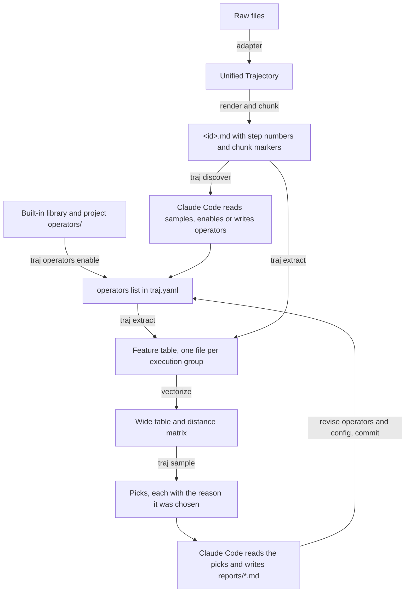

# traj-analyzer design

## 1. Goal

traj-analyzer analyses batches of LLM trajectories in any format.
A set of enabled operators turns each trajectory into features, a sampler picks the few trajectories most worth reading in that feature space, and Claude Code reads them and writes an insight report.

Both people and agents use it.
Every command runs non-interactively, prints one JSON document to stdout, and writes logs to stderr.

## 2. Overall flow



The work splits into two layers:

| Layer | Responsibility | Form |
|---|---|---|
| `traj` CLI | ingest, render, chunk, manage operators, schedule extraction, store, vectorize, sample | Python package with deterministic steps |
| Claude Code skills | discover features, write operators, read samples, write reports, feed findings back into operators and config | `.claude/skills/` of an analysis project |

## 3. Analysis project

The tool repository and analysis projects are separate.
An analysis project is a git repository created by `traj init <dir>`:

| Path | Content | In git |
|---|---|---|
| `traj.yaml` | datasets, enabled operators, call groups, rendering, engine, extraction concurrency | yes |
| `operators/**/*.py` | project operators, one per file | yes |
| `samplers/<name>.yaml` | sampling strategies | yes |
| `adapters/*.py` | project adapters, one per file | yes |
| `reports/*.md` | reports written by Claude Code | yes |
| `.claude/skills/` | the skills `traj-features`, `traj-discover` and `traj-report` | yes |
| `.traj/datasets/<dataset>/` | `<id>.json`, `<id>.md`, `index.jsonl` | no |
| `.traj/instructions/` | instruction files generated for call groups | no |
| `.traj/mailbox/` | aifn tasks and conclusions, which also serve as the cache | no |
| `.traj/features/<group>.jsonl` | feature table | no |
| `.traj/samples/<sampler>/<run>/selection.json` | sampling results | no |

Every change to operators, configuration, samplers and reports can be traced through diffs and commit messages.
Everything under `.traj/` can be regenerated from those files and the raw data.

## 4. Unified trajectory

| Type | Field | Meaning |
|---|---|---|
| Trajectory | `id` | unique within the dataset |
| | `dataset` | dataset name |
| | `metadata` | any key-value pairs, such as cwd, model, title or reward |
| | `steps` | list of Step |
| Step | `index` | step number starting at 0 |
| | `role` | `user`, `assistant`, `tool`, `system` |
| | `kind` | `message`, `thinking`, `tool_call`, `tool_result` |
| | `content` | text |
| | `name` | tool name for `tool_call` and `tool_result`, or the name of a special step |
| | `is_error` | whether a `tool_result` is an error |
| | `timestamp` | time stamp |

A trajectory is identified globally by `<dataset>/<id>`, called its key.

### 4.1 Adapters

An adapter turns raw files into trajectories.
An adapter is a Python file `<name>.py` that defines `ADAPTER`, the adapter class; it is constructed as `ADAPTER(**options)`, and `read(path, dataset)` returns every trajectory in one input file.
Built-in adapters live in `traj_analyzer/adapters/` of the package, project adapters in `adapters/` of the analysis project, and a project adapter overrides a built-in adapter of the same name.
In `traj.yaml`, `datasets` gives each dataset its adapter name, input globs, exclude globs, adapter options and a description; an adapter from an installed package is named as `module:Class`.
`traj adapters list` shows every adapter and the datasets that use it.

The built-in `claude_code` adapter reads Claude Code session files.
It reads `user` and `assistant` records in file order, so turns abandoned by a rewind stay in the trajectory.
User records whose `origin.kind` is not `human`, such as background task notifications, become `system` steps.
User text starting with tags such as `<command-name>`, `<local-command-stdout>` or `<bash-input>` records local commands and also becomes `system` steps.
It supports the content block types `text`, `image`, `thinking`, `tool_use`, `tool_result` and `fallback`; any other type stops ingestion with an error.
Empty `thinking` blocks produce no step.

The built-in `messages` adapter reads records that each hold a list of messages, in the OpenAI chat, Anthropic messages or ShareGPT format.
The message list is a JSON array or a JSON string, as `messages_encoding` says.
`role_key` and `content_key` name the role and content fields; ShareGPT uses `from` and `value`.

How message fields become steps:

| Field | Steps |
|---|---|
| `content` as a string | one step, with role and kind from the role mapping |
| `content` as a list of parts | adjacent text parts merge into one step; OpenAI `text`, `refusal`, `image_url`, `input_audio` and `file` parts and Anthropic `text`, `image`, `document`, `thinking`, `redacted_thinking`, `tool_use` and `tool_result` blocks are each converted by type |
| `tool_calls` | one `tool_call` step per call, with arguments given as a string or a JSON object |
| `function_call` | one `tool_call` step |
| `tool_call_id`, `tool_call_ids` | the `tool_result` step takes the tool name of the call with that id |
| `name` | the tool name of a tool result message without a call id |
| `reasoning_content`, `reasoning` | one `thinking` step when `include_thinking` is true |
| `refusal`, `audio` | one step marked `[refusal]` or `[audio]` |

A field whose value is null counts as absent.
A message field outside this table stops ingestion with an error; fields known to be irrelevant go into `ignore_keys`.
When a tool result message has both `name` and a call id, the tool name comes from the call with that id, because some exports fill `name` with a placeholder such as `unknown_tool`.
An Anthropic `tool_result` block becomes a step with role `tool`, even inside a user message.

`role_map` adds to or overrides the default role mapping.
By default `system` and `developer` map to system, `user` and `human` to user, `assistant` and `gpt` to assistant, and `tool` and `function` to a tool `tool_result`.
An unmapped role stops ingestion with an error.
`tool_call_format` says how the content of a message of kind `tool_call` encodes the tool name: `text`, `json` or `python_literal`.
A record whose message list is null or empty stops ingestion with an error, unless `skip_empty` is true.

A corrupt input file stops ingestion with an error that names the file and line.
Files to skip go into the dataset's `exclude` list.

### 4.2 Rendering and chunking

Rendering writes a trajectory as Markdown, with one heading per step such as `### #12 assistant · tool_call · Bash`.
Content longer than `render.max_step_chars` is cut, with a note of how many characters were cut.

Chunks break between steps, each chunk holds at most `render.chunk_chars` characters, and a `<!-- chunk 3 -->` marker opens each chunk.
A step longer than the limit forms a chunk of its own.

The Markdown opens with the dataset description and a JSON block of metadata.
The description comes from `datasets.<name>.description` and tells LLM operators what the trajectories are, which conventions they follow, and which defects the data has.
Keys listed in `render.hide_metadata` stay out of the Markdown, so LLM operators do not see them, for example model names and evaluation results; they stay in `<id>.json`, where code operators read them.
Entries are keys or glob patterns such as `eval_*`.

Each trajectory has two files for two readers:

| File | Reader | Content |
|---|---|---|
| `<id>.json` | code operators | the complete trajectory, with uncut steps and all metadata |
| `<id>.md` | LLM operators and people | readable text with step numbers, chunk markers and the dataset description; long steps are cut and hidden metadata is left out |

Project operator files import shared modules whose names start with an underscore from the operator root, for example `from rca._parse import calls`, because loading project operators adds the project's `operators/` to `sys.path`.
Project adapters and project operators are imported by the same loader.

## 5. Operators

### 5.1 Operator files

An operator is a reusable feature extractor with parameters.
An operator is a Python file that defines `OPERATOR`, an instance of `traj_analyzer.operators.base.Operator`.

Every feature is atomic: a yes or no, or a set copied from the text, readable directly from the text without multi-step reasoning.
Questions answered by structured fields go to code operators; questions that need reading what a user or a model wrote go to LLM operators, for example "does the user correct the assistant".
Conclusions that need judgement, such as "the agent locked onto a hypothesis too early", are not features; samplers or reports combine atomic features into them.
The `traj-features` skill in the project template gives the full rules and examples.
An operator's name is its path relative to the operator root, so `user/corrects.py` is `user.corrects`.

| Field | Meaning |
|---|---|
| `kind` | `code` or `llm` |
| `description` | one sentence on what the operator extracts |
| `params` | a Pydantic model whose fields have defaults |
| `outputs(params)` | the list of `FeatureSpec` the operator produces |
| `compute(trajectory, params)` | code operators only: a value for every output name |
| `guidance(params)` | LLM operators only: judging criteria written into the instruction |
| `requires(trajectory)` | whether the operator applies to a trajectory; the others get empty values |
| `tags` | scenario tags such as `chat` or `agent`, for filtering the library |

An LLM operator file:

```python
from traj_analyzer.operators.base import FeatureSpec, NoParams, Operator, has_user_messages


def outputs(params: NoParams) -> list[FeatureSpec]:
    return [FeatureSpec(
        name="user_corrects", type="boolean",
        description="A user message points out that the assistant got something wrong: a wrong fact, a misread "
                    "request, a bug it introduced, or a change the user did not ask for. Polite corrections count.",
    )]


OPERATOR = Operator(
    kind="llm",
    description="Whether the user corrects the assistant.",
    tags=("chat", "agent"),
    outputs=outputs,
    requires=has_user_messages,
)
```

A feature is named with a noun, such as `tool_calls`, or with a noun and a verb, such as `user_corrects`; a name never starts with a verb.

### 5.2 Where operators come from

| Source | Location |
|---|---|
| built-in library | `traj_analyzer/operators/library/` of the package |
| project operators | `operators/` of the analysis project |

A project operator overrides a built-in operator of the same name.
Files whose names start with an underscore are not operators and hold code shared by operators.

The built-in library:

| Operator | Kind | Features | Type |
|---|---|---|---|
| `stats.basic` | code | `n_steps`, `n_user_turns`, `total_chars`, `duration_minutes` | scalar |
| `stats.tool_usage` | code | `n_tool_calls`, `tool_error_rate` | scalar |
| | | `tool_calls`, `tool_errors`: calls and errors per tool | map |
| `meta.fields` | code | chosen metadata fields, set by the `fields` parameter | per parameter |
| `task.request_kinds` | llm | `request_kinds`: the kinds of request the user's messages make | set |
| `user.complains` | llm | `user_complains`: the user writes that they are unhappy with the assistant | boolean |
| `user.corrects` | llm | `user_corrects`: the user points out that the assistant got something wrong | boolean |
| `user.follow_up` | llm | `user_follow_up`: the user asks a further question or makes a further request after an answer | boolean |
| `user.approves` | llm | `user_approves`: the user accepts the result | boolean |
| `assistant.claims_done` | llm | `assistant_claims_done`: the assistant writes that the task is done | boolean |
| `assistant.asks_user` | llm | `assistant_asks_user`: the assistant asks the user a question | boolean |

Every built-in LLM feature is atomic and can be answered by finding one statement.

The `fields` parameter of `meta.fields` maps feature names to field definitions.
A field definition has the metadata key `key`, the feature type `type` (`boolean`, `scalar`, `category`, `set` or `map`), and optional `labels`, `range`, `thresholds` and `required`.
`required` defaults to true, and a missing key then stops extraction with an error; when false, the feature is empty.
This operator brings outside information such as evaluation results, model names and case attributes into the feature table for sampling conditions and reports.

### 5.3 Enabling operators

The `operators` list in `traj.yaml` decides which operators run:

```yaml
operators:
  - use: stats.basic
  - use: user.corrects
    call: dialogue
  - use: task.request_kinds
    call: dialogue
  - use: task.request_kinds
    as: coarse
    prefix: coarse
    call: dialogue
    params:
      labels: {change: Change code or text., other: Anything else.}

calls:
  dialogue: {evidence: true, model: DeepSeek-V4-pro}
```

| Field | Meaning |
|---|---|
| `use` | operator name |
| `as` | instance name, the operator name by default; it tells apart instances of one operator enabled several times |
| `prefix` | prepended as `<prefix>_` to every feature name of the instance, so that repeated instances do not clash |
| `call` | LLM operators only: the call group, `default` by default |
| `params` | overrides of the operator's parameter defaults |

`calls` sets `model` and `evidence` per call group.
`model` overrides `engine.model`; with `evidence` true, the default, every feature comes with a short justification citing step numbers.

Feature names are unique within a project, because they become column names of the wide table; a clash is a configuration error.

### 5.4 Execution groups

Enabled operators form execution groups, the unit of extraction, caching and the feature table:

| Group | Members | Name |
|---|---|---|
| code group | one code operator instance | the instance name with dots replaced by hyphens, e.g. `stats-basic` |
| LLM group | every LLM operator instance of one `call` | the value of `call` |

One LLM group is one aifn `AiFunction`: each trajectory gets one call, and the model returns every feature of the group at once.

### 5.5 Feature types

| type | Value | Required fields | Optional fields | Example |
|---|---|---|---|---|
| `boolean` | yes or no | | | whether the user corrects the assistant |
| `scalar` | one number | | `range` | number of steps, tool error rate |
| `category` | one label | | `labels`, any non-empty string without them | system, model name |
| `set` | a list of distinct labels | | `labels`, any non-empty string without them | kinds of user request, services the agent suspected |
| `vector` | an ordered list of numbers | `per: chunk` or `length: k` | `range` for every element | errors per chunk |
| `map` | label to number | | `labels` for the keys, any non-empty string without them; `range` for the values | calls per tool |

`boolean`, `set`, `vector` and `map` are the four basic shapes; `scalar` and `category` are a vector and a set with one element.
Every type can carry `thresholds`, which sampling conditions reference by name.
Values returned by code operators are checked against the same types, and a failed check stops extraction with an error.

### 5.6 From an LLM group to an aifn function

1. `pydantic.create_model` turns every feature of the group into a Pydantic output model; `range`, `labels` and distinct set items become validation rules.
   When the agent submits an invalid answer, aifn returns the field paths and errors to the agent, which corrects and resubmits.
2. The group is rendered into `.traj/instructions/<group>.md`: the task, the file layout, each operator's description and guidance, each feature's definition and constraints, and how to write evidence.
3. The request is `{trajectory_file, n_chunks, sha256, model}`, where `sha256` is the content hash of the Markdown file.
   The workspace is the dataset's render directory, read-only.
4. The aifn mailbox answers a call from an earlier conclusion when the function name, request, instruction and workspace are all the same.
   The instruction comes from the operators and their parameters, and the request carries the content hash and the model name, so changing an operator, re-ingesting a changed Markdown file or switching models calls the model again; everything else is served from the cache.
   Before submitting, the calls already in the mailbox are read once into an index, and each request only looks up that index.

### 5.7 Extraction

`traj extract` runs these steps:

1. When there are LLM groups, check that every environment variable in `engine.env_passthrough` is set, and stop with an error if one is missing.
2. Read each trajectory's JSON once: compute every code group, and decide for every instance of every LLM group whether it applies.
   Code values are checked against their feature types, with one validator built per feature.
3. For each LLM group, trajectories with no applicable instance get no model call; every other trajectory gets one task, and tasks with an earlier conclusion reuse it.
4. When tasks are outstanding, start `extract.workers` subprocesses `python -m aifn worker traj_analyzer.runtime:make_worker --once`.
   Workers find the project through the environment variable `TRAJ_PROJECT` and build the same functions from the same configuration.
   Workers exit when the queue is empty, and any worker exiting with a non-zero code stops the command with an error.
5. Read every conclusion and write `.traj/features/<group>.jsonl`, one line `{key, group, feature, value, evidence, status, detail}` per feature.
   When the operator does not apply, `value` is empty and `detail` is `not applicable`.
   Refusals have status `refused`, execution failures `failed`, and per-chunk vectors whose length differs from the chunk count `invalid_length`.

The feature table always holds what the last `traj extract` wrote: rows of the trajectories in that run are replaced, and other rows stay.
After changing operators or configuration, or re-ingesting data, run `traj extract` again to refresh it: code groups are always recomputed at little cost, and LLM groups call the model only for what changed.
`traj extract --dry-run` only looks up the cache, writes no tasks and leaves the feature table alone; for LLM groups, its `pending` count is the number of model calls a run would make.
Every worker run processes every unfinished task in the mailbox, including tasks left by an interrupted run.

### 5.8 Model configuration

The `engine` section of `traj.yaml` decides which model computes LLM operators:

| Field | Purpose |
|---|---|
| `dsh_home` | the dsh home where the aifn harness bundle is installed |
| `provider`, `model` | the dsh provider and model name; `calls.<call>.model` overrides the model per call group |
| `max_tokens`, `reasoning_effort` | generation parameters passed to the model |
| `env_passthrough` | names of environment variables passed to the dsh runtime, usually credentials and endpoints |
| `patches` | dsh patch files relative to the project root, which add provider routes |

A model behind an OpenAI-compatible endpoint is reached through a patch on the `llm-pi-ai` row of the `sdk` profile:

```yaml
- id: llm-pi-ai
  config:
    providers:
      litellm:
        displayName: LiteLLM proxy
        apiKeyEnv: LITELLM_API_KEY
        api: openai-completions
        baseURL: !!js process.env.LITELLM_BASE_URL
        models:
          - id: DeepSeek-V4-flash
            contextWindow: 262144
```

The matching `engine` configuration is `provider: litellm`, `model: DeepSeek-V4-flash`, `env_passthrough: [LITELLM_API_KEY, LITELLM_BASE_URL]` and `patches: [engine/litellm.patch.yml]`.
Endpoints and keys arrive through environment variables and are never written into project files.

### 5.9 Feature discovery

`traj discover` is sampling with a single strategy: by default diversity sampling over the features of every code group, taking the trajectory nearest each cluster centre and reporting its rendered file and cluster size.
`--group` chooses the groups to sample over, and `--method random` samples at random; both need those groups extracted first.
The `traj-discover` skill guides Claude Code through these steps:

1. Read the samples and note how the trajectories differ.
2. Find operators that capture the differences with `traj operators list` and `traj operators show`, and enable them with `traj operators enable`.
3. For differences the library does not cover, write new operators in the project's `operators/`, following the `traj-features` skill.
4. Check the configuration with `traj validate`, and try the operators on a few trajectories with `traj extract --limit`.

People review the git diff before committing.
Project operators useful across projects can move into the built-in library.

## 6. Sampling

### 6.1 Vectorization

Each feature expands into columns of the wide table:

| type | Query columns, for conditions | Distance columns, for clustering and outliers |
|---|---|---|
| scalar, boolean | `name` | `name` |
| category | `name`, as a string | one one-hot column per label |
| set | one multi-hot column per label, and `name__count` | one multi-hot column per label |
| vector | `name__max`, `__min`, `__mean`, `__first`, `__last` | the vector resampled to `sampling.vector_length` points, plus the five aggregates |
| map | one column per key, 0 when a trajectory's map lacks the key | same |

Category, set and map features without `labels` use the 100 most frequent labels as columns.
The wide table reads the enabled features from the feature table and takes only values with status `ok`; rows with other statuses are empty in the wide table.
`traj status` counts, per group, the trajectories with rows (`extracted`), those without (`missing`), and the rows by status.
Distance columns are standardized, and missing values are filled with the column mean.
Each feature's weight is divided by the square root of its column count, so features with many columns do not dominate distances.

### 6.2 Strategies

```yaml
name: default
budget: 40
seed: 0
features: all
strategies:
  - kind: target
    label: corrected
    quota: 0.25
    where: "user_corrects == 1"
    within: diversity
  - kind: outlier
    label: outlier
    quota: 0.25
    method: isolation_forest
  - kind: diversity
    label: diverse
    quota: rest
```

`features` is `all`, a list of feature names, or a map from feature name to weight.
`population` defaults to `complete`, which samples only trajectories with a feature-table row for every sampler feature; rows with empty values count, such as an operator that does not apply, `tool_error_rate` without tool results, or a refused or failed model call.
`population: all` samples every trajectory.
`quota` is a fraction between 0 and 1, an integer, or `rest`.
Strategies run in order, and a trajectory picked once is not picked again.

| kind | Method | Reason recorded |
|---|---|---|
| `target` | filter with `pandas.DataFrame.query` on `where`, with `{feature.threshold}` replaced by the threshold from the feature definition, then pick within the subset as `within` says | the condition, the number of matches, and the ranking value or cluster |
| `outlier` | score with `isolation_forest` or `knn` and take the highest scores | method, score, rank |
| `diversity` | cluster into quota clusters with KMeans; clusters take turns from the largest down, each giving its free member nearest the centre | cluster number, size and share |
| `random` | pick at random | none |

`within` is `diversity`, `random`, `top:<column>` or `bottom:<column>`.
The result is written to `selection.json` and printed to stdout.
It holds the population size, each strategy's quota, picks and target matches, and the list of picks.
Each pick holds the key, the rendered file, the strategy, the reason, and every query column of the trajectory.

## 7. Reports and feedback

The `traj-report` skill guides Claude Code through these steps:

1. Run `traj extract` for the groups the sampler uses, and check with `traj status` that they have no `missing` trajectories.
2. Run `traj table --format describe` for the overall distributions.
3. Run `traj sample` for the picks and their reasons.
4. Read the picked trajectories and check their feature values.
5. Write `reports/<date>-<topic>.md`, citing trajectory keys and step numbers for every finding.
6. Write the resulting changes to operators, enabled configuration and samplers, run `traj validate`, and commit them with the report, naming the report in the commit message.

## 8. CLI

| Command | Purpose |
|---|---|
| `traj init <dir>` | create an analysis project |
| `traj ingest [dataset...]` | read raw data and write the unified and rendered files |
| `traj adapters list` | list built-in and project adapters and the datasets using them |
| `traj operators list [--tag t] [--kind code\|llm]` | list built-in and project operators and where they are enabled |
| `traj operators show <name>` | show an operator's parameters, defaults, outputs, guidance and file |
| `traj operators enable <name> [--as a] [--prefix p] [--call c] [--param k=v...]` | enable an operator in `traj.yaml`, keeping the file's comments and layout |
| `traj operators disable <name>` | remove the entries whose operator or instance name is `<name>` from `traj.yaml` |
| `traj validate [--instructions]` | check the configuration, every group and every sampler, and print the generated output schemas |
| `traj discover [--n 20] [--method diversity\|random] [--group g...]` | pick trajectories for feature discovery |
| `traj extract [--group g] [--dataset d] [--key k] [--limit n] [--workers n] [--dry-run]` | extract features |
| `traj table [--format json\|csv\|describe] [--columns c...]` | print the wide table |
| `traj sample [--sampler default] [--budget n]` | sample |
| `traj show <key> [--cat]` | print a trajectory's rendered file and features, or its rendered content |
| `traj status` | print dataset sizes and extraction coverage per group |

`operators enable` and `operators disable` validate the whole modified configuration before writing `traj.yaml`.
Exit codes: 0 success, 1 runtime error, 2 usage or configuration error.

## 9. Extension points

The pipeline of ingestion, rendering, extraction, caching, vectorization and sampling is fixed; new data and new features are added as files:

| To add | Add | Where | Interface |
|---|---|---|---|
| a data source | an adapter file `<name>.py` | the project's `adapters/`; general ones in `traj_analyzer/adapters/` of the package | defines the class `ADAPTER`, constructed from `datasets.<name>.options`; `read(path, dataset)` returns trajectories |
| features | an operator file `<namespace>/<name>.py` | the project's `operators/`; general ones in `traj_analyzer/operators/library/` of the package | defines `OPERATOR`; `outputs` returns `FeatureSpec` of the six feature types |
| a sampling scheme | a sampler file `<name>.yaml` | the project's `samplers/` | `SamplerSpec` |

Adapters and operators meet only through the Trajectory.
When project operators depend on conventions of an adapter, such as metadata keys or the `name` of special steps, those conventions are constants in the adapter file and appear in the dataset description.
New files need no registration: `traj adapters list` and `traj operators list` find them, and a project file overrides a package file of the same name.

## Appendix

### A. What chunks are for

aifn's DeepSeek engine lets the agent read files in the workspace with file tools, so long files are read in parts.
Chunk markers serve per-chunk features: they keep the length of a per-chunk vector, and the meaning of each element, the same across calls.

### B. Length check of per-chunk vectors

The output model is built once per group, without knowing any trajectory's chunk count, so vector lengths are checked when conclusions are written to the feature table.
The instruction asks for a length equal to `n_chunks` in the input.

### C. Test data

Tests use real data: samples of the public UltraChat and Toucan datasets, and a fragment of this repository's design conversation as a Claude Code session.
`tests/data/messages/` holds samples of six public datasets covering the message structures of the `messages` adapter:

| File | Dataset | Structures covered |
|---|---|---|
| `unified.jsonl` | ChrisDing1105/unified-agent-trajectories | `tool_calls`, `tool_call_id`, `reasoning_content`, arguments as objects |
| `openhands.jsonl` | SWE-Gym/OpenHands-Sampled-Trajectories | fields set to null, `name` on tool result messages |
| `swesmith.jsonl` | SWE-bench/SWE-smith-trajectories | content as a list of parts, `tool_call_ids`, extra fields needing `ignore_keys` |
| `nlile.jsonl` | nlile/misc-merged-claude-code-traces-v1 | Anthropic `text`, `tool_use` and `tool_result` blocks |
| `mimo.jsonl` | choucsan/mimo-claude-code-traces-1k | the placeholder tool name `unknown_tool` |
| `hermes.jsonl` | NousResearch/hermes-function-calling-v1 | ShareGPT `from` and `value` |

The session fragment leaves out `attachment` records, which hold the user's environment details.
`tests/data/replay/` holds aifn event records and submissions of real model runs on three Toucan trajectories, named by the content hash of the rendered file.
The outputs of `tests/data/operators/fixture/outcome.py` match those records, and tests replay them through aifn's `ReplayEngine`, covering the whole path from submitting tasks through worker execution and output validation to the feature table.
