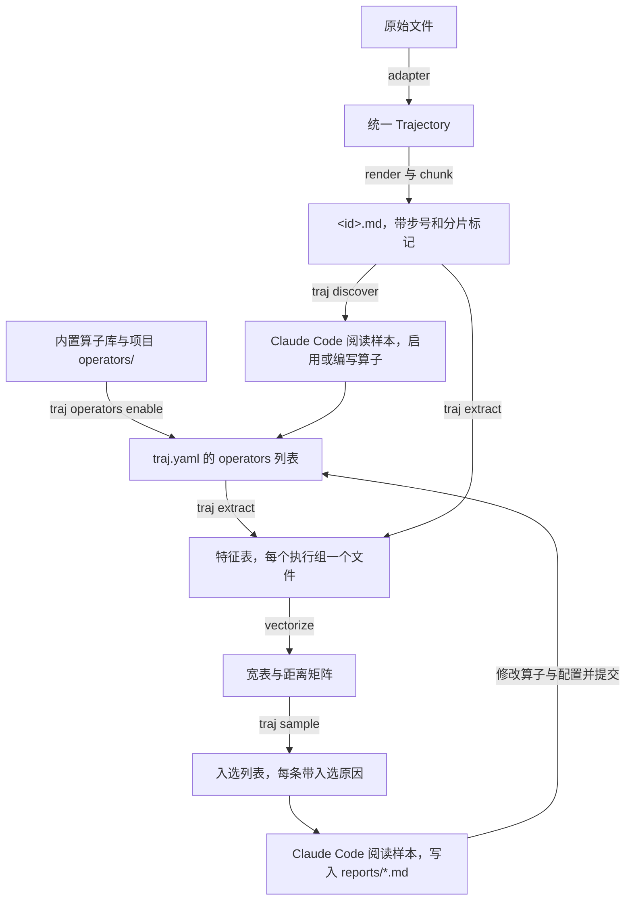

# traj-analyzer 设计文档

## 1. 目标

traj-analyzer 对一批任意格式的 LLM trajectory 做批量分析。
它用一组可以选择启用的算子把每条 trajectory 转换成数值特征，在特征空间上采样出少量最值得阅读的 trajectory，再由 Claude Code 阅读这些样本并撰写 insight 报告。

使用者包括人和 agent。
所有命令都以非交互方式执行，stdout 只输出一个 JSON 文档，日志写到 stderr。

## 2. 总体流程



工作分为两层：

| 层 | 负责的工作 | 形式 |
|---|---|---|
| `traj` CLI | 读入、渲染、分片、算子管理、特征提取调度、存储、向量化、采样 | Python 包，执行过程确定 |
| Claude Code skill | 特征发现、编写算子、阅读样本、撰写报告、把反馈写回算子与配置 | 分析项目中的 `.claude/skills/` |

## 3. 分析项目

工具仓库和分析项目相互独立。
分析项目是一个 git 仓库，由 `traj init <dir>` 生成，包含以下内容：

| 路径 | 内容 | 是否进入 git |
|---|---|---|
| `traj.yaml` | 数据集、启用的算子、调用组、渲染、engine、提取并发 | 是 |
| `operators/**/*.py` | 项目自带的算子，每个文件一个算子 | 是 |
| `samplers/<name>.yaml` | 采样策略 | 是 |
| `adapters/*.py` | 项目自带的适配器 | 是 |
| `reports/*.md` | Claude Code 撰写的报告 | 是 |
| `.claude/skills/` | `traj-discover` 和 `traj-report` 两个 skill | 是 |
| `.traj/datasets/<dataset>/` | `<id>.json`、`<id>.md`、`index.jsonl` | 否 |
| `.traj/instructions/` | 由调用组生成的 instruction 文件 | 否 |
| `.traj/mailbox/` | aifn 的任务与结论，同时作为缓存 | 否 |
| `.traj/features/<group>.jsonl` | 特征表 | 否 |
| `.traj/samples/<sampler>/<run>/selection.json` | 采样结果 | 否 |

算子、配置、采样策略和报告的每次变化都可以通过 diff 和 commit message 追溯。
`.traj/` 中的内容都可以由这些文件和原始数据重新生成。

## 4. 统一 Trajectory

| 类型 | 字段 | 说明 |
|---|---|---|
| Trajectory | `id` | 数据集内唯一 |
| | `dataset` | 数据集名 |
| | `metadata` | 任意键值，例如 cwd、模型、标题、reward |
| | `steps` | Step 列表 |
| Step | `index` | 从 0 开始的步号 |
| | `role` | `user`、`assistant`、`tool`、`system` |
| | `kind` | `message`、`thinking`、`tool_call`、`tool_result` |
| | `content` | 文本 |
| | `name` | 工具名，用于 `tool_call` 和 `tool_result` |
| | `is_error` | `tool_result` 是否报错 |
| | `timestamp` | 时间戳 |

trajectory 的全局标识是 `<dataset>/<id>`，文档中称为 key。

### 4.1 适配器

适配器把原始文件转换成 Trajectory。
`traj.yaml` 的 `datasets` 为每个数据集指定适配器、输入 glob 列表、排除 glob 列表和适配器参数。
适配器可以是内置名称、`module:Class`，或者项目内的 `adapters/foo.py:Class`。

内置的 `claude_code` 适配器读取 Claude Code session 文件。
它按文件顺序读取 `user` 和 `assistant` 记录，所以通过回退放弃的对话轮次也保留在 trajectory 中。
`origin.kind` 不是 `human` 的 user 记录，例如后台任务通知，转换为 `system` 步骤。
以 `<command-name>`、`<local-command-stdout>`、`<bash-input>` 等标签开头的 user 文本是本地命令的记录，同样转换为 `system` 步骤。
它支持的内容块类型是 `text`、`image`、`thinking`、`tool_use`、`tool_result` 和 `fallback`，其他类型会使读入过程报错终止。
为空的 `thinking` 块不产生步骤。

内置的 `messages` 适配器读取每条记录带一个消息列表的数据，支持 OpenAI chat 格式、Anthropic messages 格式和 ShareGPT 格式。
消息列表可以是 JSON 数组，也可以是 JSON 字符串，由 `messages_encoding` 指定。
`role_key` 和 `content_key` 指定角色和内容的字段名，ShareGPT 格式使用 `from` 和 `value`。

消息中各字段的解析方式：

| 字段 | 产生的步骤 |
|---|---|
| `content` 为字符串 | 一个步骤，role 和 kind 由角色映射决定 |
| `content` 为片段列表 | 相邻的文本片段合并为一个步骤；OpenAI 的 `text`、`refusal`、`image_url`、`input_audio`、`file` 片段，以及 Anthropic 的 `text`、`image`、`document`、`thinking`、`redacted_thinking`、`tool_use`、`tool_result` 块各自按类型转换 |
| `tool_calls` | 每个调用一个 `tool_call` 步骤，arguments 为字符串或 JSON 对象 |
| `function_call` | 一个 `tool_call` 步骤 |
| `tool_call_id`、`tool_call_ids` | 按调用 id 找到对应的 `tool_call`，用它的工具名命名 `tool_result` 步骤 |
| `name` | 工具结果消息没有调用 id 时，用作工具名 |
| `reasoning_content`、`reasoning` | `include_thinking` 为 true 时产生一个 `thinking` 步骤 |
| `refusal`、`audio` | 各产生一个带 `[refusal]` 或 `[audio]` 标记的步骤 |

值为 null 的字段视为不存在。
消息中出现上表之外的字段时读入过程报错终止，确认可以忽略的字段写入 `ignore_keys`。
工具结果消息同时带 `name` 和调用 id 时，工具名取自调用 id 对应的调用，因为一些导出数据把 `name` 填成 `unknown_tool` 这样的占位值。
Anthropic 块中的 `tool_result` 转换为 role 为 `tool` 的步骤，即使它出现在 user 消息中。

`role_map` 在默认映射之上增加或覆盖角色映射。
默认映射是：`system` 和 `developer` 映射到 system；`user` 和 `human` 映射到 user；`assistant` 和 `gpt` 映射到 assistant；`tool` 和 `function` 映射到 tool 的 `tool_result`。
出现未映射的角色时读入过程报错终止。
`tool_call_format` 指定 kind 为 `tool_call` 的消息内容如何编码工具名，取值为 `text`、`json` 或 `python_literal`。
消息列表为 null 或为空的记录会使读入过程报错终止，`skip_empty` 为 true 时跳过这些记录。

读入时遇到损坏的文件会报错终止，并给出文件路径和行号。
需要跳过的文件写入该数据集的 `exclude` 列表。

### 4.2 渲染与分片

渲染把 Trajectory 写成 Markdown，每步一个标题 `### #12 assistant · tool_call · Bash`。
超过 `render.max_step_chars` 的内容会被截断，并注明截断的字符数。

分片在步与步之间切分，每片不超过 `render.chunk_chars` 个字符，片头写入 `<!-- chunk 3 -->` 标记。
单个步骤超过上限时独占一片。

## 5. 算子

### 5.1 算子文件

算子是带参数的、可复用的特征提取器。
一个算子是一个 Python 文件，文件中定义 `OPERATOR`，它是 `traj_analyzer.operators.base.Operator` 的实例。
算子名由文件相对算子根目录的路径得到，例如 `collab/user_frustration.py` 的算子名是 `collab.user_frustration`。

| 字段 | 含义 |
|---|---|
| `kind` | `code` 或 `llm` |
| `description` | 一句话说明算子提取什么 |
| `params` | Pydantic 模型，字段带默认值 |
| `outputs(params)` | 返回 `FeatureSpec` 列表，即该算子产出的特征 |
| `compute(trajectory, params)` | 只用于 code 算子，返回每个输出名对应的值 |
| `guidance(params)` | 只用于 llm 算子，返回写入 instruction 的判断标准 |
| `requires(trajectory)` | 判断算子是否适用于这条 trajectory，不适用时特征值为空 |
| `tags` | 场景标签，例如 `chat`、`agent`，用于筛选算子库 |

下面是一个 llm 算子文件：

```python
from pydantic import BaseModel, ConfigDict

from traj_analyzer.operators.base import FeatureSpec, Operator, has_user_messages


class Params(BaseModel):
    model_config = ConfigDict(extra="forbid")

    high: float = 0.5


def outputs(params: Params) -> list[FeatureSpec]:
    return [FeatureSpec(name="user_frustration", type="scalar", range=(0, 1),
                        thresholds={"high": params.high},
                        description="How much the user had to push back on the assistant.")]


OPERATOR = Operator(
    kind="llm",
    description="How much the user had to correct or push back on the assistant.",
    params=Params,
    outputs=outputs,
    guidance=lambda params: "Score 0.3 for one correction and 0.6 for several.",
    requires=has_user_messages,
)
```

### 5.2 算子来源

| 来源 | 位置 |
|---|---|
| 内置算子库 | 包内的 `traj_analyzer/operators/library/` |
| 项目算子 | 分析项目的 `operators/` |

项目算子与内置算子同名时，项目算子生效。
文件名以下划线开头的文件不是算子，可以存放多个算子共用的代码。

内置算子库包含以下算子：

| 算子 | kind | 输出 |
|---|---|---|
| `stats.basic` | code | `n_steps`、`n_user_turns`、`total_chars`、`duration_minutes` |
| `stats.tool_usage` | code | `n_tool_calls`、`tool_error_rate`、`tools_used` |
| `outcome.task_type` | llm | `task_type` |
| `outcome.task_completed` | llm | `task_completed` |
| `collab.user_frustration` | llm | `user_frustration`、`frustration_curve` |
| `collab.failure_modes` | llm | `failure_modes` |

`collab.user_frustration` 和 `collab.failure_modes` 把用户纠正 assistant 的内容计为不满和失误，即使纠正的语气很平和。

### 5.3 启用算子

`traj.yaml` 的 `operators` 列表决定启用哪些算子：

```yaml
operators:
  - use: stats.basic
  - use: collab.user_frustration
    call: outcome
    params: {high: 0.6}
  - use: collab.user_frustration
    as: strict
    call: strict
    params: {high: 0.3}

calls:
  outcome: {evidence: true}
  strict: {model: DeepSeek-V4-pro}
```

| 字段 | 含义 |
|---|---|
| `use` | 算子名 |
| `as` | 实例名；算子只有一个输出时，特征名改为该实例名，有多个输出时，特征名改为 `<实例名>_<输出名>` |
| `call` | 只用于 llm 算子，指定调用组，缺省为 `default` |
| `params` | 覆盖算子参数的默认值 |

`calls` 为调用组设置 `model` 和 `evidence`。
`model` 覆盖 `engine.model`，`evidence` 为 true 时每个特征附带一段引用步号的判断依据，缺省为 true。

同一个算子可以用不同的 `as` 和参数启用多次。
特征名在整个项目内唯一，因为它们会成为宽表的列名，重名时配置校验报错。

### 5.4 执行组

启用的算子组成执行组，执行组是提取、缓存和特征表的单位：

| 执行组 | 组成 | 组名 |
|---|---|---|
| code 执行组 | 一个 code 算子实例 | 实例名，其中的点号换成短横线，例如 `stats-basic` |
| llm 执行组 | 同一个 `call` 的全部 llm 算子实例 | `call` 的值 |

一个 llm 执行组对应一个 aifn `AiFunction`，每条 trajectory 只调用一次，模型一次输出组内所有特征。
修改组内某个算子的代码、参数或实例名时，只有这个执行组需要重新计算。

执行组的 `spec_hash` 由组内每个实例的算子名、源码哈希、实例名和参数，以及调用组的 `model` 和 `evidence` 计算。
源码哈希覆盖算子文件，以及同一算子根目录下所有以下划线开头的共享文件。

### 5.5 特征类型

| type | 输出 | 必需字段 | 可选字段 |
|---|---|---|---|
| `scalar` | 浮点数 | | `range` |
| `boolean` | 布尔值 | | |
| `category` | 单个标签 | `labels` | |
| `set` | 互不相同的标签列表 | | `labels`，缺省时为自由字符串 |
| `vector` | 浮点数列表 | `per: chunk` 或 `length: k` | `range` |
| `distribution` | 标签到概率的映射，总和为 1 | `labels` | |

所有类型都可以带 `thresholds`，采样条件按名称引用这些阈值。
code 算子返回的值按同样的类型校验，校验失败时提取报错终止。

### 5.6 llm 执行组生成 aifn 函数

1. `pydantic.create_model` 把执行组的全部特征转换成 Pydantic 输出模型，`range`、`labels`、元素互不相同和概率总和都成为校验规则。
   agent 提交的结果不合法时，aifn 把字段路径和错误信息反馈给 agent，由 agent 修正后重新提交。
2. 执行组渲染成 `.traj/instructions/<group>.md`，内容包括任务说明、文件结构、每个算子的说明和 guidance、每个特征的定义和取值约束、依据的写法。
3. 请求内容是 `{trajectory_file, n_chunks, sha256}`。
   workspace 是该数据集的渲染目录，权限为只读。
4. aifn 的 mailbox 对函数名、输入、instruction 和 workspace 都相同的请求直接复用已有结论。
   请求中包含渲染文件的内容哈希，instruction 由算子生成，所以数据或算子变化时会重新计算，其余部分直接使用缓存。

### 5.7 提取调度

`traj extract` 按以下步骤执行：

1. 存在 llm 执行组时，检查 `engine.env_passthrough` 中的环境变量是否都已设置，缺少时报错终止。
2. 对每个 code 执行组，逐条 trajectory 调用 `requires` 和 `compute`。
3. 对每个 llm 执行组，逐条 trajectory 判断组内每个实例是否适用。
   没有适用实例的 trajectory 不调用模型，其余 trajectory 各提交一个任务，已有结论的任务直接复用。
4. 存在未完成的任务时，启动 `extract.workers` 个 `python -m aifn worker traj_analyzer.runtime:make_worker --once` 子进程。
   worker 通过环境变量 `TRAJ_PROJECT` 找到项目，并由同一份配置构建相同的函数表。
   队列清空后 worker 退出，任何 worker 以非零状态码退出时命令报错终止。
5. 读取全部结论，写入 `.traj/features/<group>.jsonl`，每行是 `{key, group, feature, value, evidence, status, detail, spec_hash, sha256}`。
   `sha256` 是计算时渲染文件的内容哈希。
   算子不适用时 `value` 为空，`detail` 为 `not applicable`。
   拒答写为 `refused`，执行失败写为 `failed`，逐片向量长度与分片数不一致写为 `invalid_length`。

`--dry-run` 只查询缓存，不向 mailbox 写入任务。
worker 每次运行都会处理 mailbox 中全部未完成的任务，包括之前中断的运行留下的任务。

### 5.8 模型配置

`traj.yaml` 的 `engine` 段决定 llm 算子由哪个模型计算：

| 字段 | 作用 |
|---|---|
| `dsh_home` | 安装了 aifn harness bundle 的 dsh home |
| `provider`、`model` | dsh 中的 provider 名和模型名，调用组可以用 `calls.<call>.model` 覆盖模型名 |
| `max_tokens`、`reasoning_effort` | 传给模型的生成参数 |
| `env_passthrough` | 传给 dsh 运行时的环境变量名，通常是 API key |
| `patches` | 相对项目根目录的 dsh patch 文件列表，用于添加 provider 路由 |

通过 OpenAI 兼容接口访问模型时，在 patch 中配置 `sdk` profile 的 `llm-pi-ai` 行：

```yaml
- id: llm-pi-ai
  config:
    providers:
      litellm:
        displayName: LiteLLM proxy
        apiKeyEnv: LITELLM_API_KEY
        api: openai-completions
        baseURL: http://host:port/v1
        models:
          - id: DeepSeek-V4-flash
            contextWindow: 262144
```

对应的 `engine` 配置是 `provider: litellm`、`model: DeepSeek-V4-flash`、`env_passthrough: [LITELLM_API_KEY]`、`patches: [engine/litellm.patch.yml]`。

### 5.9 特征发现

`traj discover` 默认在全部 code 执行组的特征上做 KMeans 聚类，从每个簇中取离中心最近的 trajectory，并输出渲染文件路径和所在簇的大小。
`--group` 指定参与聚类的执行组，`--method random` 改为随机抽取。
`traj-discover` skill 指导 Claude Code 按以下顺序工作：

1. 阅读样本，记录 trajectory 之间的差异。
2. 用 `traj operators list` 和 `traj operators show` 查找能表达这些差异的算子，用 `traj operators enable` 启用。
3. 算子库没有覆盖的差异，在项目的 `operators/` 中编写新算子。
4. 用 `traj validate` 检查配置，用 `traj extract --limit` 在少量样本上试跑。

人通过 git diff 审阅后提交。
在多个项目中都有用的项目算子可以移入内置算子库。

## 6. 采样

### 6.1 向量化

每个特征展开成宽表中的若干列：

| type | 查询列，用于条件筛选 | 距离列，用于聚类和离群检测 |
|---|---|---|
| scalar、boolean | `name` | `name` |
| category | `name`，字符串 | 每个标签一列 one-hot |
| set | 每个标签一列 multi-hot，以及 `name__count` | 每个标签一列 multi-hot |
| vector | `name__max`、`__min`、`__mean`、`__first`、`__last` | 重采样到 `sampling.vector_length` 个点，加上五个聚合列 |
| distribution | 每个标签一列概率 | 同左 |

只有状态为 `ok`、`spec_hash` 与当前执行组一致、`sha256` 与当前渲染文件一致的特征值进入宽表。
`traj status` 按同样的条件统计每个执行组：`ok` 和 `not_ok` 是按当前定义和当前内容计算的结果，`stale` 是定义或内容变化后需要重算的数量，`missing` 是从未计算的数量。
距离列先做标准化，缺失值填为该列均值。
每个特征的权重除以其列数的平方根，使列数多的特征不会主导距离。

### 6.2 策略

```yaml
name: default
budget: 40
seed: 0
features: all
strategies:
  - kind: target
    label: frustrated
    quota: 0.25
    where: "user_frustration >= {user_frustration.high}"
    within: diversity
  - kind: outlier
    label: outlier
    quota: 0.25
    method: isolation_forest
  - kind: diversity
    label: diverse
    quota: rest
```

`features` 可以是 `all`、特征名列表，或者特征名到权重的映射。
`population` 默认为 `complete`，只在所有采样特征都已按当前定义和当前内容计算的 trajectory 中采样；值为空的特征，例如算子不适用或没有工具结果时的 `tool_error_rate`，也算作已计算。
`population: all` 在全部 trajectory 中采样。
`quota` 可以是 0 到 1 之间的比例、整数或 `rest`。
策略按列表顺序执行，已入选的 trajectory 不会再次入选。

| kind | 做法 | 入选原因 |
|---|---|---|
| `target` | 用 `pandas.DataFrame.query` 按 `where` 筛选，`{feature.threshold}` 替换为算子输出中的阈值，再按 `within` 在子集内挑选 | 条件、命中数量，以及排序列的值或簇信息 |
| `outlier` | `isolation_forest` 或 `knn` 打分，取分数最高的 | 方法、分数、排名 |
| `diversity` | KMeans 聚成 quota 个簇，簇按大小依次轮流取离中心最近的未入选成员 | 簇编号、簇大小、簇占比 |
| `random` | 随机抽取 | 无 |

`within` 取值为 `diversity`、`random`、`top:<列名>` 或 `bottom:<列名>`。
采样结果写入 `selection.json` 并打印到 stdout。
结果包含采样总体的大小、每个策略的配额、实际入选数和 target 策略的命中数，以及入选列表。
入选列表中每条包含 key、渲染文件路径、策略、入选原因和该条 trajectory 的全部查询列。

## 7. 报告与反馈

`traj-report` skill 指导 Claude Code 按以下步骤工作：

1. 运行 `traj status`，确认采样用到的执行组都已按当前定义完成提取。
2. 运行 `traj table --format describe` 查看整体分布。
3. 运行 `traj sample`，得到入选列表和入选原因。
4. 阅读入选的渲染文件，核对特征值是否正确。
5. 在 `reports/<日期>-<主题>.md` 中撰写报告，每条结论引用 trajectory key 和步号。
6. 把对算子、启用配置和采样策略的修改写入文件，运行 `traj validate`，与报告一起提交，commit message 写明依据的报告。

## 8. CLI

| 命令 | 作用 |
|---|---|
| `traj init <dir>` | 生成分析项目 |
| `traj ingest [dataset...]` | 读入原始数据，写出统一格式和渲染文件 |
| `traj operators list [--tag t] [--kind code\|llm]` | 列出内置算子库和项目中的算子，以及各自的启用情况 |
| `traj operators show <name>` | 输出算子的参数、默认值、输出、guidance 和文件路径 |
| `traj operators enable <name> [--as a] [--call c] [--param k=v...]` | 在 `traj.yaml` 中启用算子，保留文件中的注释和格式 |
| `traj operators disable <name>` | 从 `traj.yaml` 中移除算子名或实例名等于 `<name>` 的条目 |
| `traj validate [--instructions]` | 校验配置、全部执行组和采样策略，输出生成的输出 schema |
| `traj discover [--n 20] [--method diversity\|random] [--group g...]` | 挑选用于特征发现的样本 |
| `traj extract [--group g] [--dataset d] [--key k] [--limit n] [--workers n] [--dry-run]` | 提取特征 |
| `traj table [--format json\|csv\|describe] [--columns c...]` | 输出宽表 |
| `traj sample [--sampler default] [--budget n]` | 采样 |
| `traj show <key> [--cat]` | 输出某条 trajectory 的渲染文件路径和特征，或输出渲染内容 |
| `traj status` | 输出数据集规模和各执行组的提取情况 |

`operators enable` 和 `operators disable` 先校验修改后的完整配置，校验通过后才写入 `traj.yaml`。
退出码：0 表示成功，1 表示运行错误，2 表示用法或配置错误。

## 附录

### A. 分片的用途

aifn 的 DeepSeek engine 让 agent 在 workspace 中用文件工具阅读文件，长文件可以分段读取。
分片标记用于逐片特征，保证逐片向量的长度和每个元素的含义在不同调用之间一致。

### B. 逐片向量的长度检查

输出模型按执行组生成，生成时无法得知每条 trajectory 的分片数，所以向量长度在结论写入特征表时检查。
instruction 要求向量长度等于输入中的 `n_chunks`。

### C. 测试数据

测试使用真实数据：UltraChat 和 Toucan 两个公开数据集的样本，以及本仓库设计讨论的 Claude Code session 片段。
`tests/data/messages/` 保存了六个公开数据集的样本，覆盖 `messages` 适配器支持的各种消息结构：

| 文件 | 数据集 | 覆盖的结构 |
|---|---|---|
| `unified.jsonl` | ChrisDing1105/unified-agent-trajectories | `tool_calls`、`tool_call_id`、`reasoning_content`、对象形式的 arguments |
| `openhands.jsonl` | SWE-Gym/OpenHands-Sampled-Trajectories | 值为 null 的字段、工具结果消息的 `name` |
| `swesmith.jsonl` | SWE-bench/SWE-smith-trajectories | 片段列表形式的 content、`tool_call_ids`、需要 `ignore_keys` 的额外字段 |
| `nlile.jsonl` | nlile/misc-merged-claude-code-traces-v1 | Anthropic 的 `text`、`tool_use`、`tool_result` 块 |
| `mimo.jsonl` | choucsan/mimo-claude-code-traces-1k | 占位值 `unknown_tool` 的工具名 |
| `hermes.jsonl` | NousResearch/hermes-function-calling-v1 | ShareGPT 的 `from` 和 `value` |

session 片段不包含 `attachment` 记录，因为这些记录保存了用户的环境信息。
`tests/data/replay/` 保存了在三条 Toucan trajectory 上真实调用模型得到的 aifn 事件记录和提交结果，按渲染文件的内容哈希命名。
`tests/data/operators/fixture/outcome.py` 的输出与这些记录一致，测试通过 aifn 的 `ReplayEngine` 重放记录，覆盖从提交任务、worker 执行、输出校验到写入特征表的完整路径。
