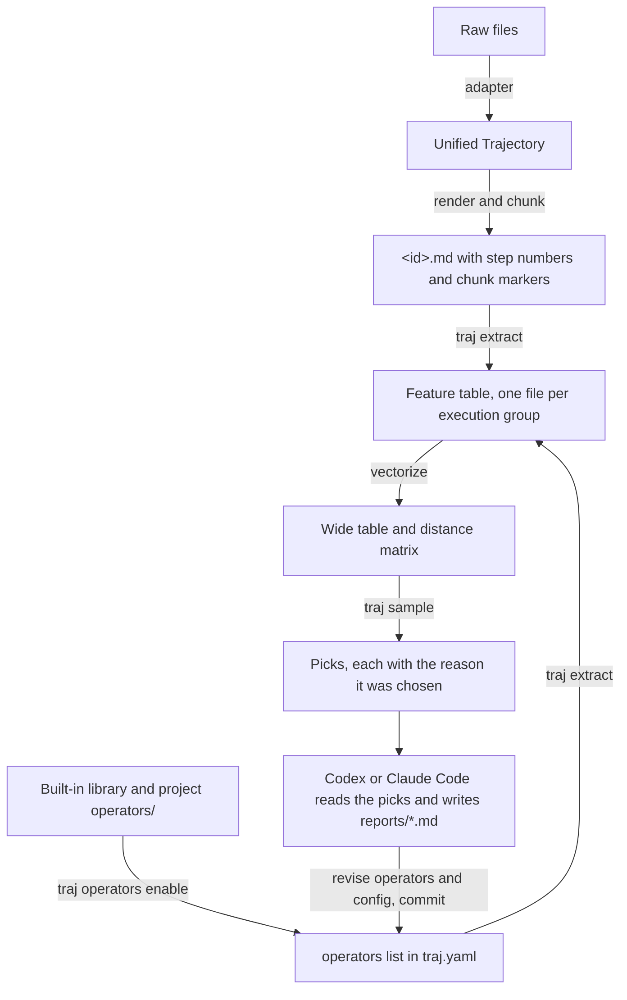

# traj-analyzer design

## 1. Goal

traj-analyzer analyses batches of LLM trajectories in any format.
A set of enabled operators turns each trajectory into features, a sampler picks the few trajectories most worth reading in that feature space, and Codex or Claude Code reads them and writes an insight report.

Both people and agents use it.
Every command runs non-interactively, prints one JSON document to stdout, or CSV for `traj table`, and writes logs to stderr.

## 2. Overall flow


```mermaid
flowchart TD
    raw[Raw files] -->|adapter| unified[Unified Trajectory]
    unified -->|render and chunk| md["&lt;id&gt;.md with step numbers and chunk markers"]
    library[Built-in library and project operators/] -->|traj operators enable| config["operators list in traj.yaml"]
    config -->|traj extract| table[Feature table, one file per execution group]
    md -->|traj extract| table
    table -->|vectorize| frame[Wide table and distance matrix]
    frame -->|traj sample| picks[Picks, each with the reason it was chosen]
    picks --> report["Codex or Claude Code reads the picks and writes reports/*.md"]
    report -->|revise operators and config, commit| config
```

The work splits into two layers:

| Layer | Responsibility | Form |
|---|---|---|
| `traj` CLI | ingest, render, chunk, manage operators, schedule extraction, store, vectorize, sample | Python package with deterministic steps, a typer application |
| Shared agent skills | write operators, read samples, write reports, feed findings back into operators and config | `.claude/skills/` holds the content, `.agents/skills/` links to it for Codex; both are installed by `traj init` |

The skills are written once, in `.claude/skills/` of the tool repository.
The project template `src/traj_analyzer/templates/project/claude/skills/` holds a symbolic link to each skill file, so the package ships their content, and a new skill file needs a link there as well.
Codex discovers the same repository skills through relative directory links in `.agents/skills/`.
`traj init` copies the packaged skill files into the analysis project's `.claude/skills/` and links each `.agents/skills/<name>` directory to `../../.claude/skills/<name>`.
Linking the whole skill directory shares `SKILL.md` and any scripts, references or assets.
The links stay valid when the analysis project is moved.
The initializer discovers all bundled skill directories and checks for conflicting Codex destinations before copying files.
An existing matching link is reused; a conflicting destination is a configuration error even with `--force`.

## 3. Analysis project

The tool repository and analysis projects are separate.
An analysis project is a git repository created by `traj init <dir>`:

| Path | Content | In git |
|---|---|---|
| `traj.yaml` | datasets, enabled operators, call groups, rendering, engine, extraction concurrency | yes |
| `pyproject.toml` | optional; libraries the project's operators and adapters import, next to traj-analyzer itself, so `uv run traj` in the project uses them | yes |
| `operators/**/*.py` | project operators, one per file | yes |
| `samplers/<name>.yaml` | sampling strategies | yes |
| `adapters/*.py` | project adapters, one per file | yes |
| `reports/*.md` | reports written by Codex or Claude Code | yes |
| `.claude/skills/` | shared skill content copied from the tool repository | yes |
| `.agents/skills/<name>` | relative directory links to the shared skills for Codex | yes |
| `.traj/datasets/<dataset>/` | `<id>.json`, `<id>.md`, `index.jsonl` | no |
| `.traj/instructions/` | instruction files generated for call groups | no |
| `.traj/mailbox/` | aifn tasks and conclusions, which also serve as the cache | no |
| `.traj/features/<group>.parquet` | feature table | no |
| `.traj/samples/<sampler>/<run>/selection.json` | sampling results | no |
| `.traj/evaluation/` | second measurements per group and `features.json`, the result of `traj evaluate` | no |
| `.traj/mining/<round>/` | proposals, candidates, trial values and `report.json` of one mining round | no |

`traj mine` writes the code operators it accepts to `operators/mined/<name>.py` and the LLM features it accepts to `traj.yaml`, so they are in git like every other operator.

Every change to operators, configuration, samplers and reports can be traced through diffs and commit messages.
Everything under `.traj/` can be regenerated from those files and the raw data.

## 4. Unified trajectory

| Type | Field | Meaning |
|---|---|---|
| Trajectory | `id` | unique within the dataset |
| | `dataset` | dataset name |
| | `metadata` | any key-value pairs, such as cwd, model, title or reward |
| | `steps` | list of Step |
| Step | `index` | step number starting at 0 |
| | `role` | `user`, `assistant`, `tool`, `system` |
| | `kind` | `message`, `thinking`, `tool_call`, `tool_result` |
| | `content` | text |
| | `name` | tool name for `tool_call` and `tool_result`, or the name of a special step |
| | `is_error` | whether a `tool_result` is an error |
| | `timestamp` | time stamp |

A trajectory is identified globally by `<dataset>/<id>`, called its key.

### 4.1 Adapters

An adapter turns raw files into trajectories.
An adapter is a Python file `<name>.py` that defines `ADAPTER`, the adapter class; it is constructed as `ADAPTER(**options)`, and `read(path, dataset)` returns every trajectory in one input file.
Built-in adapters live in `traj_analyzer/adapters/` of the package, project adapters in `adapters/` of the analysis project, and a project adapter overrides a built-in adapter of the same name.
In `traj.yaml`, `datasets` gives each dataset its adapter name, input globs, exclude globs, adapter options and a description; an adapter from an installed package is named as `module:Class`.
`traj adapters list` shows every adapter and the datasets that use it.

The built-in `claude_code` adapter reads Claude Code session files.
It reads `user` and `assistant` records in file order, so turns abandoned by a rewind stay in the trajectory.
User records whose `origin.kind` is not `human`, such as background task notifications, become `system` steps.
User text starting with tags such as `<command-name>`, `<local-command-stdout>` or `<bash-input>` records local commands and also becomes `system` steps.
It supports the content block types `text`, `image`, `thinking`, `tool_use`, `tool_result` and `fallback`; any other type stops ingestion with an error.
Empty `thinking` blocks produce no step.

The built-in `messages` adapter reads records that each hold a list of messages, in the OpenAI chat, Anthropic messages or ShareGPT format.
The message list is a JSON array or a JSON string, as `messages_encoding` says.
`role_key` and `content_key` name the role and content fields; ShareGPT uses `from` and `value`.

How message fields become steps:

| Field | Steps |
|---|---|
| `content` as a string | one step, with role and kind from the role mapping |
| `content` as a list of parts | adjacent text parts merge into one step; OpenAI `text`, `refusal`, `image_url`, `input_audio` and `file` parts and Anthropic `text`, `image`, `document`, `thinking`, `redacted_thinking`, `tool_use` and `tool_result` blocks are each converted by type |
| `tool_calls` | one `tool_call` step per call, with arguments given as a string or a JSON object |
| `function_call` | one `tool_call` step |
| `tool_call_id`, `tool_call_ids` | the `tool_result` step takes the tool name of the call with that id |
| `name` | the tool name of a tool result message without a call id |
| `reasoning_content`, `reasoning` | one `thinking` step when `include_thinking` is true |
| `refusal`, `audio` | one step marked `[refusal]` or `[audio]` |

A field whose value is null counts as absent.
A message field outside this table stops ingestion with an error; fields known to be irrelevant go into `ignore_keys`.
When a tool result message has both `name` and a call id, the tool name comes from the call with that id, because some exports fill `name` with a placeholder such as `unknown_tool`.
An Anthropic `tool_result` block becomes a step with role `tool`, even inside a user message.

`role_map` adds to or overrides the default role mapping.
By default `system` and `developer` map to system, `user` and `human` to user, `assistant` and `gpt` to assistant, and `tool` and `function` to a tool `tool_result`.
An unmapped role stops ingestion with an error.
`tool_call_format` says how the content of a message of kind `tool_call` encodes the tool name: `text`, `json` or `python_literal`.
A record whose message list is null or empty stops ingestion with an error, unless `skip_empty` is true.

A corrupt input file stops ingestion with an error that names the file and line.
Files to skip go into the dataset's `exclude` list.

### 4.2 Rendering and chunking

Rendering writes a trajectory as Markdown, with one heading per step such as `### #12 assistant · tool_call · Bash`.
Content longer than `render.max_step_chars` is cut, with a note of how many characters were cut.

Chunks break between steps, each chunk holds at most `render.chunk_chars` characters, and a `<!-- chunk 3 -->` marker opens each chunk.
A step longer than the limit forms a chunk of its own.

The Markdown opens with the dataset description and a JSON block of metadata.
The description comes from `datasets.<name>.description` and tells LLM operators what the trajectories are, which conventions they follow, and which defects the data has.
Keys listed in `render.hide_metadata` stay out of the Markdown, so LLM operators do not see them, for example model names and evaluation results; they stay in `<id>.json`, where code operators read them.
Entries are keys or glob patterns such as `eval_*`.

Each trajectory has two files for two readers:

| File | Reader | Content |
|---|---|---|
| `<id>.json` | code operators | the complete trajectory, with uncut steps and all metadata |
| `<id>.md` | LLM operators and people | readable text with step numbers, chunk markers and the dataset description; long steps are cut and hidden metadata is left out |

Project operator files import shared modules whose names start with an underscore from the operator root, for example `from rca._parse import calls`, because loading project operators adds the project's `operators/` to `sys.path`.
Project adapters and project operators are imported by the same loader.

## 5. Operators

### 5.1 Operator files

An operator is a reusable feature extractor with parameters.
An operator is a Python file that defines `OPERATOR`, an instance of `traj_analyzer.operators.base.Operator`.

Every feature is atomic: a yes or no, or a set copied from the text, readable directly from the text without multi-step reasoning.
Questions answered by structured fields go to code operators; questions that need reading what a user or a model wrote go to LLM operators, for example "does the user correct the assistant".
Conclusions that need judgement, such as "the agent locked onto a hypothesis too early", are not features; samplers or reports combine atomic features into them.
The `traj-features` skill gives the full rules and examples.
An operator's name is its path relative to the operator root, so `user/corrects.py` is `user.corrects`.

| Field | Meaning |
|---|---|
| `kind` | `code` or `llm` |
| `description` | one sentence on what the operator extracts |
| `params` | a Pydantic model whose fields have defaults |
| `outputs(params)` | the list of `FeatureSpec` the operator produces |
| `compute(trajectory, params)` | code operators only: a value for every output name |
| `guidance(params)` | LLM operators only: judging criteria written into the instruction |
| `requires(trajectory)` | whether the operator applies to a trajectory; the others get empty values |
| `tags` | scenario tags such as `chat` or `agent`, for filtering the library |

An LLM operator file:

```python
from traj_analyzer.operators.base import FeatureSpec, NoParams, Operator, has_user_messages


def outputs(params: NoParams) -> list[FeatureSpec]:
    return [FeatureSpec(
        name="user_corrects", type="boolean",
        description="A user message points out that the assistant got something wrong: a wrong fact, a misread "
                    "request, a bug it introduced, or a change the user did not ask for. Polite corrections count.",
    )]


OPERATOR = Operator(
    kind="llm",
    description="Whether the user corrects the assistant.",
    tags=("chat", "agent"),
    outputs=outputs,
    requires=has_user_messages,
)
```

A feature is named with a noun, such as `tool_calls`, or with a noun and a verb, such as `user_corrects`; a name never starts with a verb.

### 5.2 Where operators come from

| Source | Location |
|---|---|
| built-in library | `traj_analyzer/operators/library/` of the package |
| project operators | `operators/` of the analysis project |

A project operator overrides a built-in operator of the same name.
Files whose names start with an underscore are not operators and hold code shared by operators.
Project operators useful across projects can move into the built-in library.

The built-in library:

| Operator | Kind | Features | Type |
|---|---|---|---|
| `stats.basic` | code | `n_steps`, `n_user_turns`, `total_chars`, `duration_minutes` | scalar |
| `stats.tool_usage` | code | `n_tool_calls`, `tool_error_rate` | scalar |
| | | `tool_calls`, `tool_errors`: calls and errors per tool | map |
| `stats.tool_paths` | code | `tool_paths`: one path per tool call, the tool name and then its outcome | paths |
| `meta.fields` | code | chosen metadata fields, set by the `fields` parameter | per parameter |
| `task.request_kinds` | llm | `request_kinds`: the kinds of request the user's messages make | set |
| `user.complains` | llm | `user_complains`: the user writes that they are unhappy with the assistant | boolean |
| `user.corrects` | llm | `user_corrects`: the user points out that the assistant got something wrong | boolean |
| `user.follow_up` | llm | `user_follow_up`: the user asks a further question or makes a further request after an answer | boolean |
| `user.approves` | llm | `user_approves`: the user accepts the result | boolean |
| `assistant.claims_done` | llm | `assistant_claims_done`: the assistant writes that the task is done | boolean |
| `assistant.asks_user` | llm | `assistant_asks_user`: the assistant asks the user a question | boolean |
| `llm.features` | llm | features defined in `traj.yaml`, set by the `features` parameter | boolean, category or set |

Every built-in LLM feature is atomic and can be answered by finding one statement.

The `features` parameter of `llm.features` maps feature names to a definition with `type`, `description`, optional `labels`, and optional `guidance`, the judging criteria written into the instruction.
An LLM feature needs nothing beyond its `FeatureSpec`, so this operator defines one in configuration without a Python file; `traj mine` adds the LLM features it accepts through it.

The `fields` parameter of `meta.fields` maps feature names to field definitions.
A field definition has the metadata key `key`, the feature type `type` (`boolean`, `scalar`, `category`, `set` or `map`), and optional `labels`, `range`, `thresholds` and `required`.
`required` defaults to true, and a missing key then stops extraction with an error; when false, the feature is empty.
This operator brings outside information such as evaluation results, model names and case attributes into the feature table for sampling conditions and reports.

### 5.3 Enabling operators

The `operators` list in `traj.yaml` decides which operators run:

```yaml
operators:
  - use: stats.basic
  - use: user.corrects
    call: dialogue
  - use: task.request_kinds
    call: dialogue
  - use: task.request_kinds
    as: coarse
    prefix: coarse
    call: dialogue
    params:
      labels: {change: Change code or text., other: Anything else.}

calls:
  dialogue: {evidence: true, model: DeepSeek-V4-pro}
```

| Field | Meaning |
|---|---|
| `use` | operator name |
| `as` | instance name, the operator name by default; it tells apart instances of one operator enabled several times |
| `prefix` | prepended as `<prefix>_` to every feature name of the instance, so that repeated instances do not clash |
| `call` | LLM operators only: the call group, `default` by default |
| `params` | overrides of the operator's parameter defaults |

`calls` sets `model` and `evidence` per call group.
`model` overrides `engine.model`; with `evidence` true, the default, every feature comes with a short justification citing step numbers.

Feature names are unique within a project, because they become column names of the wide table; a clash is a configuration error.

### 5.4 Execution groups

Enabled operators form execution groups, the unit of extraction, caching and the feature table:

| Group | Members | Name |
|---|---|---|
| code group | one code operator instance | the instance name with dots replaced by hyphens, e.g. `stats-basic` |
| LLM group | every LLM operator instance of one `call` | the value of `call` |

One LLM group is one aifn `AiFunction`: each trajectory gets one call, and the model returns every feature of the group at once.

### 5.5 Feature types

| type | Value | Required fields | Optional fields | Example |
|---|---|---|---|---|
| `boolean` | yes or no | | | whether the user corrects the assistant |
| `scalar` | one number | | `range` | number of steps, tool error rate |
| `category` | one label | | `labels`, any non-empty string without them | system, model name |
| `set` | a list of distinct labels | | `labels`, any non-empty string without them | kinds of user request, services the agent suspected |
| `vector` | an ordered list of numbers | `per: chunk` or `length: k` | `range` for every element | errors per chunk |
| `map` | label to number | | `labels` for the keys, any non-empty string without them; `range` for the values | calls per tool |

| `paths` | a list of paths, one per event of the trajectory in order; a path has one label per level | `levels`, the level names from the coarsest to the finest | | every query as kinds, scope, measures |

`boolean`, `set`, `vector` and `map` are the four basic shapes; `scalar` and `category` are a vector and a set with one element.
`paths` is the shape for events inside a trajectory, such as tool calls: each level of a path refines the level before it, so the paths of a population form a tree that section 6.3 cuts by support.
Only code operators produce paths.
Every type can carry `thresholds`, which sampling conditions reference by name.
Values returned by code operators are checked against the same types, and a failed check stops extraction with an error.

### 5.6 From an LLM group to an aifn function

1. `pydantic.create_model` turns every feature of the group into a Pydantic output model; `range`, `labels` and distinct set items become validation rules.
   When the agent submits an invalid answer, aifn returns the field paths and errors to the agent, which corrects and resubmits.
2. The group is rendered into `.traj/instructions/<group>.md`: the task, the file layout, each operator's description and guidance, each feature's definition and constraints, and how to write evidence.
3. The request is `{trajectory_file, n_chunks, sha256, model}`, where `sha256` is the content hash of the Markdown file.
   The workspace is the dataset's render directory, read-only.
4. The aifn mailbox answers a call from an earlier conclusion when the function name, request, instruction and workspace are all the same.
   The instruction comes from the operators and their parameters, and the request carries the content hash and the model name, so changing an operator, re-ingesting a changed Markdown file or switching models calls the model again; everything else is served from the cache.
   Before submitting, the calls already in the mailbox are read once into an index, and each request only looks up that index.

### 5.7 Extraction

`traj extract` runs these steps:

1. Check `traj.yaml`, the enabled operators and every sampler under `samplers/`, and stop with an error if one is invalid.
2. When there are LLM groups, check that every environment variable in `engine.env_passthrough` is set, and stop with an error if one is missing.
3. Read each trajectory's JSON once: compute every code group, and decide for every instance of every LLM group whether it applies.
   Code values are checked against their feature types, with one validator built per feature.
   `extract.code_workers` processes (8 by default) share this work; each loads the project from disk and the operators with it.
4. For each LLM group, trajectories with no applicable instance get no model call; every other trajectory gets one task, and tasks with an earlier conclusion reuse it.
5. When tasks are outstanding, start `extract.workers` subprocesses `python -m aifn worker traj_analyzer.runtime:make_worker --once`.
   Workers find the project through the environment variable `TRAJ_PROJECT` and build the same functions from the same configuration.
   Workers exit when the queue is empty, and any worker exiting with a non-zero code stops the command with an error.
6. Read every conclusion and write `.traj/features/<group>.parquet`, one row per trajectory with the column `key` and, per feature, the columns `<feature>`, `<feature>__status`, `<feature>__detail`, and `<feature>__evidence` when the group cites evidence.
   The value column has the Arrow type of the feature type: `float64` for scalar, `bool` for boolean, `string` for category, `list<string>` for set, `list<float64>` for vector and `map<string, float64>` for map.
   When the operator does not apply, the value is null and the detail is `not applicable`.
   Refusals have status `refused`, execution failures `failed`, and per-chunk vectors whose length differs from the chunk count `invalid_length`.
   A null status means the trajectory has no value for that feature.
   Reading a group uses the schema of its current features: a feature the file lacks, or holds with another value type, reads as null for every trajectory until the next extraction writes it.

The output reports each group of the run, and `coverage`: per enabled group, over every ingested trajectory, how many have rows in the feature table (`extracted`), those rows counted by status, and how many have none (`missing`).

The feature table always holds what the last `traj extract` wrote: rows of the trajectories in that run are replaced, and other rows stay.
After changing operators or configuration, or re-ingesting data, run `traj extract` again to refresh it: code groups are always recomputed at little cost, and LLM groups call the model only for what changed.
`traj extract --dry-run` only looks up the cache, writes no tasks and leaves the feature table alone; for LLM groups, its `pending` count is the number of model calls a run would make.
It still writes each LLM group's instruction to `.traj/instructions/<group>.md`, so the instruction can be read before any model call.
Every worker run processes every unfinished task in the mailbox, including tasks left by an interrupted run.

### 5.8 Model configuration

The `engine` section of `traj.yaml` decides which model computes LLM operators:

| Field | Purpose |
|---|---|
| `dsh_home` | the dsh home where the aifn harness bundle is installed |
| `provider`, `model` | the dsh provider and model name; `calls.<call>.model` overrides the model per call group |
| `max_tokens`, `reasoning_effort` | generation parameters passed to the model |
| `env_passthrough` | names of environment variables passed to the dsh runtime, usually credentials and endpoints |
| `patches` | dsh patch files relative to the project root, which add provider routes |

A model behind an OpenAI-compatible endpoint is reached through a patch on the `llm-pi-ai` row of the `sdk` profile:

```yaml
- id: llm-pi-ai
  config:
    providers:
      litellm:
        displayName: LiteLLM proxy
        apiKeyEnv: LITELLM_API_KEY
        api: openai-completions
        baseURL: !!js process.env.LITELLM_BASE_URL
        models:
          - id: DeepSeek-V4-flash
            contextWindow: 262144
```

The matching `engine` configuration is `provider: litellm`, `model: DeepSeek-V4-flash`, `env_passthrough: [LITELLM_API_KEY, LITELLM_BASE_URL]` and `patches: [engine/litellm.patch.yml]`.
Endpoints and keys arrive through environment variables and are never written into project files.

## 6. Sampling

### 6.1 Vectorization

Each feature expands into columns of the wide table:

| type | Query columns, for conditions | Distance columns, for clustering and outliers |
|---|---|---|
| scalar, boolean | `name` | `name` |
| category | `name`, as a string | one one-hot column per label |
| set | one multi-hot column per label, and `name__count` | one multi-hot column per label |
| vector | `name__max`, `__min`, `__mean`, `__first`, `__last` | the vector resampled to `sampling.vector_length` points, plus the five aggregates |
| map | one column per key, 0 when a trajectory's map lacks the key | same |
| paths | one column per node of the cut (section 6.3), `name__count` and `name__rare` | one column per node of the cut |

Category, set and map features without `labels` use the 100 most frequent labels as columns.
A label's column is `<feature>__<label>` with the label verbatim, so labels that differ only in punctuation or case keep separate columns; a `where` condition names a column holding characters other than letters, digits and underscores in backticks, such as `` `query_atoms__filter:service_name` > 0.5 ``.
A set feature with a label named `count` stops with an error, since that label's column would be `<feature>__count`.
The wide table reads the enabled features from the feature table and takes only values with status `ok`; rows with other statuses are empty in the wide table.
`traj table` prints its query columns as CSV, one row per trajectory.
Distance columns of scalar, boolean and vector features are standardized.
Label columns of category, set and map features keep their values from 0 to 1, so a label few trajectories have adds little to distances.
Each feature is then scaled as a whole so that the variances of its columns sum to its weight squared, so a feature with many columns weighs as much as one with a single column.
A trajectory without a value for a feature gets 0 in its label columns and the mean in its other columns, and 1 in the column `<feature>__missing`, which the feature gets when any trajectory in the population lacks its value; a missing value thus sets a trajectory apart from the typical one.

### 6.2 Strategies

```yaml
name: default
budget: 40
seed: 0
features: all
strategies:
  - kind: target
    label: corrected
    quota: 0.25
    where: "user_corrects == 1"
    within: diversity
  - kind: outlier
    label: outlier
    quota: 0.25
  - kind: diversity
    label: diverse
    quota: rest
```

`features` is `all`, `distinguishing`, a list of feature names, or a map from feature name to weight.
`distinguishing` takes the features whose role in `.traj/evaluation/features.json` is distinguishing (section 10.3), and stops with an error when `traj evaluate` has not run.
`population` defaults to `complete`, which samples only trajectories with a feature-table row for every sampler feature; rows with empty values count, such as an operator that does not apply, `tool_error_rate` without tool results, or a refused or failed model call.
`population: all` samples every trajectory.
`quota` is a fraction between 0 and 1, an integer, or `rest`.
Strategies run in order, and a trajectory picked once is not picked again.

| kind | Method | Reason recorded |
|---|---|---|
| `target` | filter with `pandas.DataFrame.query` on `where`, with `{feature.threshold}` replaced by the threshold from the feature definition, then pick within the subset as `within` says | the condition, the number of matches, and the ranking value or cluster |
| `outlier` | score each trajectory by its mean distance to its 10 nearest neighbours and take the highest scores | score, rank, and with `relative_to` the group, its size, its median score and the relative score |
| `diversity` | cluster into quota clusters with KMeans; clusters take turns from the largest down, each giving its free member nearest the centre | cluster number, size and share |
| `random` | pick at random | none beyond the columns |
| `surprise` | rank the trajectories outside the reference set by their surprisal under the reference set (section 10.1) and take the highest | surprisal, rank, and the 5 columns or relations with the highest surprisal, each with its value and how many reference trajectories share it |

A `surprise` strategy stops with an error when every trajectory is in the reference set.

`within` is `diversity`, `random`, `top:<column>` or `bottom:<column>`.
`relative_to`, for `outlier` only, names a query column such as `model`: neighbours come from the trajectories sharing its value, and the ranking uses the score divided by the median score of that group, so each group's own unusual trajectories can rank.
Groups with fewer than 3 trajectories, and trajectories without a value in that column, are not scored, and the strategy report counts them as `unscored`.
Nearest-neighbour distances follow the scaling above, so feature weights act on outliers as they do on clusters.

Every reason also holds `columns`: the 5 columns where the pick stands furthest from what it is compared with, each with its value before scaling and its deviation in scaled units.
An outlier is compared with the mean of its neighbours, a diversity pick with the mean of the population it was clustered from, and any other pick with the mean of the trajectories its strategy chose from.
The result is written to `selection.json` and printed to stdout.
It holds the population size, each strategy's quota, picks and target matches, and the list of picks.
Each pick holds the key, the rendered file, the strategy, the reason, and every query column of the trajectory.

### 6.3 Path trees

The paths of a population form a tree: a node is a prefix of a path, and its children refine it.
This is the index a log parser builds over log lines, with one difference: each level is a facet the operator names, so the levels are exact labels and no token position or similarity threshold decides them.

| Quantity of a node | Meaning |
|---|---|
| support | trajectories with at least one event under the node |
| events | events under the node |

A node is frequent when its support reaches `sampling.path_support` of the trajectories that have a value, 1% by default.
Support never grows with depth, so the frequent nodes form a subtree, and every event belongs to its deepest frequent prefix: the node it is cut at.
Common branches are followed to the last level and rare ones stop at an ancestor, so every event has a column and none is dropped.

In the wide table, the column of a node holds the share of a trajectory's events cut there.
The column is `<feature>__<labels joined by " | ">`, and a node above the last level ends with ` | *`, since it stands for every path below it; `<feature>__*` holds the events whose first level is not frequent.
`<feature>__count` is the number of events, and `<feature>__rare` the share of events cut above the last level.

`traj tree` shows the tree of one paths feature:

- per level, the number of nodes, the number of frequent nodes, and the bits the level adds to describing one event, which is the entropy of the events over the nodes of this level minus that of the level above;
- the cut: the number of nodes used and the share of events cut at each depth;
- the most used nodes of the cut, with support and events.

With `--by`, every node also gets the share of the variation of its column across trajectories that the groups of that column explain, and every level the median over its nodes.
With `--within`, the means of the `--within` groups are removed first, so `--by model --within case_id` tells how much models differ on the same case.
A level where the share is high separates the groups at that level: with levels ordered from what is asked to how it is written, this tells apart groups that ask other questions from groups that write the same question another way.

## 7. Reports and feedback

The `traj-report` skill guides Codex or Claude Code through these steps:

1. Run `traj extract` for the groups the sampler uses, and check in its `coverage` that they have no `missing` trajectories.
2. Write `traj table` to a CSV file and read it with pandas for the overall distributions.
3. Run `traj sample` for the picks and their reasons.
4. Read the picked trajectories and check their feature values.
5. Write `reports/<date>-<topic>.md`, citing trajectory keys and step numbers for every finding.
6. Write the resulting changes to operators, enabled configuration and samplers, run `traj extract`, which checks them first, and commit them with the report, naming the report in the commit message.

## 8. CLI

| Command | Purpose |
|---|---|
| `traj init <dir>` | create an analysis project with shared skills for Codex and Claude Code |
| `traj ingest [dataset...]` | read raw data and write the unified and rendered files |
| `traj adapters list` | list built-in and project adapters and the datasets using them |
| `traj operators list [--tag t] [--kind code\|llm]` | list built-in and project operators and where they are enabled |
| `traj operators show <name>` | show an operator's parameters, defaults, outputs, guidance and file |
| `traj operators enable <name> [--as a] [--prefix p] [--call c] [--param k=v...]` | enable an operator in `traj.yaml`, keeping the file's comments and layout |
| `traj operators disable <name>` | remove the entries whose operator or instance name is `<name>` from `traj.yaml` |
| `traj extract [--group g] [--dataset d] [--key k] [--limit n] [--workers n] [--dry-run]` | check the configuration and samplers, extract features, and report coverage per group |
| `traj table [--dataset d] [--column c...]` | print the wide table as CSV |
| `traj view [--host 127.0.0.1] [--port 8000]` | serve configurable feature analysis and a searchable feature table |
| `traj sample [--sampler default] [--budget n]` | sample |
| `traj tree <feature> [--dataset d] [--support s] [--by c] [--within c] [--top n]` | show a paths feature as a tree: the size of every level, where events are cut, and the most used nodes |
| `traj evaluate [--workers n]` | measure noise, variation and dependence of every enabled feature, assign roles, and report drift of the trajectories outside the reference set |
| `traj mine [--rounds n] [--workers n]` | propose, check and revise features from the trajectories, and write the accepted ones to `operators/mined/` and `traj.yaml` |

Options that take several values repeat, such as `--group a --group b`.
`operators enable` and `operators disable` validate the whole modified configuration before writing `traj.yaml`.

`traj view` is a FastAPI application served by uvicorn, in `src/traj_analyzer/viewer/`.
At start it loads the trajectory index and every group that has a table file into an in-memory DuckDB database, then switches off DuckDB's file access.
The page offers the table `features`, which joins every group's value columns on `key` next to the trajectory's dataset, and each group's own table with its status, detail and evidence columns.
The static front end offers an Analysis mode with Perspective and a Rows mode with Tabulator.
Analysis supports configurable charts, aggregates, filters, expressions and multiple panels.
`POST /api/analysis` returns the complete filtered input as an Arrow IPC stream, bounded by explicit browser input limits.
`POST /api/profile` computes counts and numeric summary statistics over the same input population.
Collection sources expand one set, vector or map into label records with their textual trajectory context.
The assets are bundled locally, and saved workspace configurations are stored per project in browser storage or exported as JSON.
See [Interactive analysis](viewer.md) for source semantics, saved views and frontend maintenance.
Tabulator's paging, sorting and filtering run on the server.
Rows mode has three ways to narrow the rows:
- **Search box**: keeps rows where any column, printed as text, contains the words, ignoring case.
- **Filter box under each column header**: keeps rows where that column contains the typed text, ignoring case.
- **SQL condition field**: accepts a DuckDB `WHERE` condition such as `f1 < 0.3 AND gt_focused_query`, and shows DuckDB's error message when the condition is invalid.

Cells are formatted by column type:
- numbers are right aligned with at most three decimals;
- booleans are shown as small labels;
- sets and vectors are shown as a row of labels, one per item;
- maps are shown as labels of key and value, sorted by value from largest to smallest.

Hovering over a column header shows the feature's description, type, range, labels, thresholds, group and operator.
The page follows the system's light or dark color scheme.
Every response carries `Cache-Control: no-cache`, so the browser loads the current page files after an upgrade.
The page shows the data as it was when `traj view` started, so restart it after `traj extract`.
Exit codes: 0 success, 1 runtime error, 2 usage or configuration error.

## 9. Extension points

The pipeline of ingestion, rendering, extraction, caching, vectorization and sampling is fixed; new data and new features are added as files:

| To add | Add | Where | Interface |
|---|---|---|---|
| a data source | an adapter file `<name>.py` | the project's `adapters/`; general ones in `traj_analyzer/adapters/` of the package | defines the class `ADAPTER`, constructed from `datasets.<name>.options`; `read(path, dataset)` returns trajectories |
| features | an operator file `<namespace>/<name>.py` | the project's `operators/`; general ones in `traj_analyzer/operators/library/` of the package | defines `OPERATOR`; `outputs` returns `FeatureSpec` of the six feature types |
| a sampling scheme | a sampler file `<name>.yaml` | the project's `samplers/` | `SamplerSpec` |

Adapters and operators meet only through the Trajectory.
When project operators depend on conventions of an adapter, such as metadata keys or the `name` of special steps, those conventions are constants in the adapter file and appear in the dataset description.
New files need no registration: `traj adapters list` and `traj operators list` find them, and a project file overrides a package file of the same name.

## 10. Feature evaluation and mining

A feature definition plays the part a test oracle plays in software testing: it states what to observe in one execution, and it has to be proposed, checked and maintained.
`traj evaluate` judges every enabled feature by three quantities, and `traj mine` proposes new features from the trajectories and judges them the same way.
Both read and write only trajectories, `FeatureSpec`, operators and the feature table, so they hold no knowledge of what a sampler or a report later does with a feature.

### 10.1 Reference set and surprisal

The enabled features together with a reference set form a statistical model of normal behaviour.
The reference set R holds the trajectories of the datasets named in `reference.datasets`, without the keys in `reference.exclude`; every other trajectory is monitored.
With `reference.datasets: all`, the default, every trajectory is in R and nothing is monitored.

The surprisal of a trajectory `t` is the sum of one term per feature, so every unusual trajectory names the features that make it unusual.
Each term compares the value of `t` with the `n` reference trajectories that have a value for the feature:

| Columns of the wide table | Term |
|---|---|
| boolean; each label column of a set | `-ln((c + 1) / (n + 2))`, where `c` reference trajectories have the same value in the column |
| category | `-ln((c + 1) / (n + L + 1))`, where `c` reference trajectories have the same label and `L` labels occur in R |
| scalar; each column of a vector or a map | `-ln((c + 1) / (n + 1))`, where `c` reference trajectories lie at least as far from the reference median as `t` |
| `<feature>__missing` | as a boolean column |

A label that no reference trajectory has counts as a column of zeros in R, so a new label on a set or a map costs `ln(n + 2)` or `ln(n + 1)`.
A feature with several columns contributes the sum of its columns.

A paths feature contributes one term per level, named `<feature>@<level>`, in place of its node columns.
An event at a node costs `-ln((c + 1) / (p + k + 1))` at the level of that node, where the reference events hold `c` under the node and `p` under its parent, which has `k` children there; below a node R does not hold, the levels cost nothing, so a new path is charged to the first level where it is new.
A trajectory's value at a level is the mean of that cost over its events, and its term is `-ln((c + 1) / (n + 1))`, where `c` reference trajectories have a value at least as large.
The terms tell at which level a trajectory is unusual: in what it asks, or only in how it writes it.
A dependent feature (section 10.3) contributes its relation term in place of its own columns: with the predictor of section 10.2 fitted on R, `-ln((c + 1) / (n + 1))`, where `c` reference trajectories have an out-of-fold residual at least as large as the residual of `t`.

A feature that has one value throughout R contributes almost nothing inside R, and about `ln(n)` for a monitored trajectory with another value.
Having one value in `n` trajectories only bounds the share of other values below about `3 / n` at 95% confidence, so such a feature is kept as an invariant, and its violation is an anomaly that weighs more the larger R is.

### 10.2 Three quantities

| Quantity | Question | Computation |
|---|---|---|
| noise `ε` | does a second measurement give the same value? | LLM features: extract the evaluation set a second time with `evaluation.model`, and average the disagreement over the trajectories with status `ok` in both: 0 or 1 for boolean and category, the Jaccard distance for set, and 0 for two empty sets. Code features: 0, since they are deterministic. |
| variation | how many values does the feature take? | the number of distinct values over R |
| dependence `r(x→y)` | does feature x determine feature y? | variance-weighted R² of a decision tree that predicts the scaled distance columns of y from those of x, over 5 folds of the reference trajectories with values for both; 0 when fewer than 50 trajectories have both, or when y has one value among them |

An LLM feature with numbers, which the built-in library does not have, disagrees by the mean absolute difference of its numbers, divided by the width of its `range`, or by the largest magnitude when it declares none, and capped at 1; vectors of different lengths disagree by 1.

The evaluation set is `evaluation.size` reference trajectories drawn with `evaluation.seed`.
`evaluation.model` must differ from the model of every LLM group, and `traj evaluate` stops with an error when it is unset or equal.
The second measurement of a group runs through an aifn function of its own, `eval-<group>`, so the answers of the two models never share a cache entry.
Second measurements are written to `.traj/evaluation/<group>.parquet` in the layout of the feature table.
Noise bounds what a violation can show: a difference that measurement alone produces with probability `ε` carries at most `ln(1 / ε)` of evidence, and a feature produces about `N · ε` false violations over `N` monitored trajectories.

A group extracted for a part of R is judged on that part: its second measurement takes the same draw among the reference trajectories it has rows for, and every quantity of its features counts only the trajectories with a value.
`traj evaluate` stops with an error when an enabled group has rows for no reference trajectory.

### 10.3 Roles

Every enabled feature gets one role; the features that are not context are assigned in this order: code features before LLM features, then by ascending `ε`, then by name.

| Role | Condition | In distances | In surprisal |
|---|---|---|---|
| invariant | one distinct value in R | left out of `features: distinguishing` | its own columns |
| dependent | an earlier distinguishing feature e has `r(e→f) ≥ evaluation.dependence_min` | left out of `features: distinguishing` | the relation term of e→f |
| distinguishing | otherwise | included | its own columns |
| context | a feature of the `meta.fields` operator | left out of `features: distinguishing` | none |

Context features are copied metadata, such as the model, the case or an evaluation result.
They are conditions to group and compare by, in `traj tree --by`, in `relative_to` and in `where` conditions; they are not judged, they determine no other feature, and they add nothing to surprisal.
A paths feature takes no part in dependence, since it has a column per node of its tree: it is invariant with one distinct value and distinguishing otherwise.

A dependent feature stays extracted, and the relation e→f is recorded: two features that agree today can part later, and the trajectory where they part is an anomaly even when each value alone is common.
Leaving invariant and dependent features out of the distances keeps one piece of information from counting twice, and leaves the sampler's feature weights to express importance.

`.traj/evaluation/features.json` holds the evaluation set, the trajectories measured a second time per LLM group, and per feature `ε` with the number of trajectories compared, the number of reference trajectories with a value, the number of distinct values, the role, the relation, and the decision of section 10.4.
When monitored trajectories exist, it also holds per feature the Jensen-Shannon divergence between its distribution in R and in the monitored trajectories, with numeric columns binned at the deciles of R.

### 10.4 Decisions

| Condition | Decision |
|---|---|
| `ε > evaluation.noise_max` | revise once; remove when the revised feature is still above the limit |
| a set or category feature without `labels` has more than `evaluation.label_limit` distinct labels in R | revise into a closed set of `labels`; the feature stays as it is when the revision is not accepted |
| a candidate does not reproduce the value of one of its examples | an LLM candidate is revised once and rejected when the revised candidate still does not; a code candidate is rejected |
| a candidate has one distinct value over the trajectories it was extracted from and its examples together | reject: a definition never seen to take a second value cannot be told from one that always returns the same value |
| a candidate has no value that both models measured | reject |
| a candidate passes the rows above | add, with the role of section 10.3 |
| two candidates, or a candidate and an enabled feature, ask the same question | merge into one definition, in `mine-consolidate` |
| the mined LLM features number more than `mining.capacity` | remove those with the highest `ε` first, then by name |

Noise is the only reason to remove a feature for its quality: a feature without variation is an invariant, and a feature that another determines is a recorded relation.
`traj evaluate` reports decisions and changes nothing.
`traj mine` applies them to candidates and to mined features, which are the `llm.features` instance named `mined` and the files in `operators/mined/`.

### 10.5 Mining round

`traj mine` runs rounds until a round adds no feature or `--rounds`, 1 by default, is reached, and then runs `traj evaluate` once more when the last round changed the enabled features.
It stops with an error when `evaluation.model` is unset, because every candidate is measured by two models.
A deterministic driver chooses the material, computes the quantities, decides and writes files; the reading and writing steps are aifn functions.
A round whose directory has no `report.json` is run again under the same number: it chooses the same material, so its calls are answered from the conclusions already in the mailbox.

| Step | What it does | Without it |
|---|---|---|
| 1. evaluate | runs `traj evaluate` | no roles for choosing pairs, and no feature list for the proposer |
| 2. choose material | `mining.singles` random reference trajectories, and the `mining.pairs` closest pairs of reference trajectories in the distances of `features: distinguishing`, each trajectory in at most one pair; none of them from the evaluation set or from a second measurement | candidates would be judged on the trajectories they came from |
| 3. `mine-propose` | one call per single or pair: reads the files and the enabled feature definitions, and returns at most five distinctions no enabled feature expresses | no source of candidates |
| 4. `mine-consolidate` | one call per round: merges proposals that ask the same question, drops those an enabled feature already asks, and keeps at most `mining.candidates` | each reading is independent, so one candidate arrives in many wordings and the trial extraction grows with them |
| 5. `mine-implement` | one call per candidate that reads structured fields: writes a code operator file | questions that fields answer would cost one model call per trajectory |
| 6. trial extraction | LLM candidates form the group `mined-trial`, defined by `.traj/mining/trial.json` while the extraction runs; it is extracted on the evaluation set and the example trajectories with the engine model and on the evaluation set with `evaluation.model`; code candidates are computed on R and their example trajectories | the quantities cannot be computed |
| 7. decide | section 10.4 | no ground for adding, merging or removing |
| 8. `mine-revise` | one call per feature to revise: reads the disagreeing trajectories and returns a rewritten definition, several simpler definitions, a closed label set, or a drop with its reason; the result goes through steps 6 and 7 once | a noisy candidate could only be dropped, and the next round would propose it again |
| 9. apply | writes `operators/mined/` and `traj.yaml`, runs `traj extract` for the groups that gained a feature, writes `.traj/mining/<round>/report.json` and prints it | |

The mined features of a project that `traj evaluate` sends to revision enter step 8 together with the candidates.
A removed feature needs no extraction: its column stays in the table file and is no longer read.

Single trajectories are the only material when no feature is distinguishing, and they do not depend on the enabled features.
A close pair is the same under the enabled features, so the difference a reader states is what those features cannot express, as a surviving mutant shows what a test suite cannot detect.
The pair also gives each candidate two examples with different values.

Atomicity has no step of its own: a question that needs reasoning across many steps gets different values from two measurements, so its `ε` sends it to `mine-revise`.

The aifn functions:

| Function | Request | Returns | Workspace |
|---|---|---|---|
| `mine-propose` | one or two files `<dataset>/<id>.md` with their `sha256`, and the model | proposals | `.traj/datasets/`, read-only |
| `mine-consolidate` | `proposals.json`, `features.json`, and the model | candidates | `.traj/mining/<round>/`, read-only |
| `mine-implement` | the candidate and the JSON files of its example trajectories | `source`, the text of an operator file | `.traj/mining/<round>/implement/<name>/`, read-only, which also holds `schema.py`, `base.py` and a library operator as `example_operator.py` |
| `mine-revise` | the definition, up to `mining.revise_cases` cases with both values and their evidence, and the model | one of `rewrite`, `split`, `labels`, `drop` | `.traj/datasets/`, read-only |

A proposal and a candidate hold the same fields:

| Field | Meaning |
|---|---|
| `spec` | a `FeatureSpec` of type boolean, category or set for `reads: text`, and of any type for `reads: fields` |
| `reads` | `fields` when structured fields answer the question, `text` when it needs reading what someone wrote |
| `guidance` | judging criteria, for `reads: text` |
| `examples` | trajectory key, cited steps, and the value the feature has there |

The output models embed `FeatureSpec` and check every example value against the feature type, so aifn returns an invalid name, shape or value to the agent for correction.
An example counts only when its file was read in this round, and a candidate left without examples is rejected.
A candidate whose name an enabled feature already has is rejected, and the report names it.
The driver loads the file `mine-implement` returns, requires a code operator whose outputs equal the candidate's `spec`, and computes it on the examples and on R through the type check of section 5.5; any error rejects the candidate, and the report holds the error.
The instructions of `mine-propose` and `mine-revise` carry the rules for atomic features of the `traj-features` skill.

### 10.6 Monitoring

Trajectories ingested into a dataset outside `reference.datasets` are monitored.
The `surprise` strategy brings the monitored trajectories with the highest surprisal to a reader, each with the features and relations that set it apart, and `traj evaluate` reports per feature how far the monitored distribution has moved.
When a reader finds the change expected, the dataset is added to `reference.datasets`, and an invariant that now takes two values becomes a distinguishing feature at the next `traj evaluate`.
Trajectories found to be faulty go into `reference.exclude`, so they do not become part of normal behaviour.
Both changes are edits of `traj.yaml` and are committed like any other configuration change.

### 10.7 Configuration

| Field | Default | Meaning |
|---|---|---|
| `reference.datasets` | `all` | datasets whose trajectories form R, or `all` |
| `reference.exclude` | `[]` | trajectory keys left out of R |
| `evaluation.size` | 100 | trajectories in the evaluation set |
| `evaluation.seed` | 0 | seed of the evaluation set |
| `evaluation.model` | none | model of the second measurement |
| `evaluation.noise_max` | 0.1 | highest accepted `ε` |
| `evaluation.dependence_min` | 0.9 | lowest `r` that makes a feature dependent |
| `evaluation.label_limit` | 100 | most distinct labels of a set or category feature without `labels`, equal to the number of label columns the wide table keeps |
| `mining.singles` | 20 | single trajectories read per round |
| `mining.pairs` | 20 | pairs read per round |
| `mining.candidates` | 15 | most candidates a round carries into the trial extraction |
| `mining.capacity` | 30 | most mined LLM features |
| `mining.revise_cases` | 10 | most cases shown to `mine-revise` |
| `mining.model` | `engine.model` | model of the `mine-*` functions |
| `mining.timeout_s` | 1800 | time limit of one `mine-*` call |

### 10.8 Limits

- `ε` shows only differences between two models; an error both models make stays unseen.
- Dependence compares pairs of features, so a feature that several others determine together counts as distinguishing.
- The ability of an invariant to detect a change cannot be measured on data where it never changes.
- Problems already present in R count as normal behaviour.
- The three quantities show that a feature is reliable and what part it plays; how much it matters to an analysis is expressed downstream, in a sampler's feature weights.
- A code operator written by `mine-implement` runs in the project's environment without isolation.

## 11. SQL component

`traj_analyzer.sql` is a self-contained package that parses SQL text with sqlglot and describes what a query asks.
It only parses: it knows no tool, no trajectory and no feature type, and it imports nothing else of this repository.
A project's operators import it and add what belongs to the project: which tool call holds SQL, which dialect the queries use, how table names map to data sources, and what the results mean.

| Module | Provides |
|---|---|
| `parsing` | `parse(sql, dialect)`, the syntax tree or None when the text does not parse; `tables(tree)`, the table names and the file paths inside table functions; `resolve(tree, dialect)`, the tree with GROUP BY and ORDER BY ordinals replaced by what they stand for |
| `atoms` | `atoms(tree)`, `<role>:<column>` for every data column, with the roles filter, group, order, join, show and the aggregates count, avg, sum, min, max, quantile and stddev; `filter_values(tree, skip)`, `<column> <op> <value>` for string values compared with a column, leaving out the columns in `skip` |
| `shape` | `shape(tree, skip)`, the facets of a query as sorted tuples: `tables`, `scope` (filter, group and join atoms), `measures` (columns inside aggregates), `aggregates`, `shown` (show and order atoms) and `values` |
| `canonical` | `literal_template(tree, dialect, name_table)`, the query as written with literals as placeholders; `Canonical(tree, name_table)`, the form of a resolved query without the names its author chose and without the order of commutative parts |

The facets of `shape` run from what a query asks to how it is written, so a project joins them, in that order, into the levels of a paths feature (section 6.3).
Names a query defines itself, as aliases or CTEs, are not data columns, and a GROUP BY or ORDER BY key written as an ordinal or an alias counts as the select-list expression it stands for.

Two queries with the same `Canonical.text` ask the same thing: aliases are replaced by what they stand for, CTEs are written where they are read, and the operands of AND, OR, = and +, the select list, the joins and the GROUP BY keys are sorted.
`Canonical.parts` holds the text of every condition, function call, join, sort key and table read, for comparing queries by the parts they share.
`name_table` turns a table name or file path into the label the forms use, so a project decides which tables count as the same source.

No table schema is known to the component: `SELECT *` is not expanded, and a column keeps no table, so columns of the same name in two tables, and the two sides of a self-join, are not told apart.
`parse` returns None for text sqlglot rejects, and `resolve` raises what sqlglot raises on the few parsed queries it cannot resolve; the caller records both.

## Appendix

### A. What chunks are for

aifn's DeepSeek engine lets the agent read files in the workspace with file tools, so long files are read in parts.
Chunk markers serve per-chunk features: they keep the length of a per-chunk vector, and the meaning of each element, the same across calls.

### B. Length check of per-chunk vectors

The output model is built once per group, without knowing any trajectory's chunk count, so vector lengths are checked when conclusions are written to the feature table.
The instruction asks for a length equal to `n_chunks` in the input.

### C. Test data

Tests use real data: samples of the public UltraChat and Toucan datasets, and a fragment of this repository's design conversation as a Claude Code session.
`tests/data/messages/` holds samples of six public datasets covering the message structures of the `messages` adapter:

| File | Dataset | Structures covered |
|---|---|---|
| `unified.jsonl` | ChrisDing1105/unified-agent-trajectories | `tool_calls`, `tool_call_id`, `reasoning_content`, arguments as objects |
| `openhands.jsonl` | SWE-Gym/OpenHands-Sampled-Trajectories | fields set to null, `name` on tool result messages |
| `swesmith.jsonl` | SWE-bench/SWE-smith-trajectories | content as a list of parts, `tool_call_ids`, extra fields needing `ignore_keys` |
| `nlile.jsonl` | nlile/misc-merged-claude-code-traces-v1 | Anthropic `text`, `tool_use` and `tool_result` blocks |
| `mimo.jsonl` | choucsan/mimo-claude-code-traces-1k | the placeholder tool name `unknown_tool` |
| `hermes.jsonl` | NousResearch/hermes-function-calling-v1 | ShareGPT `from` and `value` |

The session fragment leaves out `attachment` records, which hold the user's environment details.
`tests/data/replay/` holds aifn event records and submissions of real model runs on three Toucan trajectories, named by the content hash of the rendered file.
The outputs of `tests/data/operators/fixture/outcome.py` match those records, and tests replay them through aifn's `ReplayEngine`, covering the whole path from submitting tasks through worker execution and output validation to the feature table.
`tests/data/mining/` holds the first 6 Toucan and 8 UltraChat conversations of those samples, and `replay/` the accepted submission of every call of one real mining round on them: 46 calls to `mine-propose`, `mine-consolidate`, `mine-revise`, the trial extractions, the extraction of the accepted features and their second measurement.
A recording is named by the hash of the call's function, request and instruction, and its event file is empty, since the worker reads only the submission.
The test replays the whole round, including a candidate that was revised for noise and rejected again.
