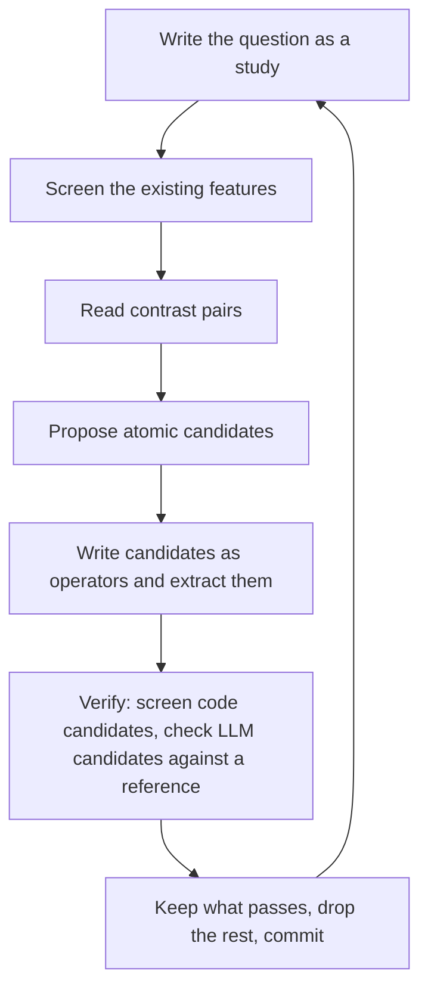

# Proposing and verifying features

A feature earns its place in two ways.
It differs between groups the user compares, such as models, or it explains which trajectories succeed once those groups are held fixed.
Every round of feature work follows one loop:

Follow the `traj-features` skill for writing each feature.

## 1. Write the question as a study

A study is a file `studies/<name>.yaml`:

| Field | Meaning |
|---|---|
| `description` | the question in one sentence |
| `datasets` | datasets to use; all by default |
| `where` | condition selecting the trajectories the question is about, written like a sampler `where` |
| `target` | expression that is true for the trajectories that succeed |
| `by` | features whose influence the screen removes, such as the model and the task id |
| `outcomes` | evaluation features, operator instance ids or glob patterns; they are never screened and never count as duplicates |
| `pairs` | `within`: the feature both trajectories of a pair share, such as a task id; `spread`: a feature the pairs take turns over; `distinct`: a feature whose values appear in at most one pair, such as the model; `n`: the number of pairs |
| `rules` | thresholds of the screen: `max_mode_share`, `max_similarity`, `min_group_excess`, `min_within_r`, `min_present` |

Split a broad outcome into stages before writing studies.
For example, a root cause analysis succeeds when it looks at the right service, then names it, then names the right fault kind.
Each stage gets its own study: `where` selects the trajectories that reached the stage, and `target` is the next step.

Features named in `by` and `pairs` must be enabled features with one column, usually categories.
Metadata such as the model or the task id becomes a feature through `meta.fields`.
Run `traj validate`; it checks every study.

## 2. Screen the existing features

Run `traj study screen <name>`.
Every feature gets one verdict:

| Verdict | Meaning | Action |
|---|---|---|
| `explains_success` | after removing the mean of every `by` group, the feature still correlates with success | keep |
| `varies_by` | a `by` group, such as the model, explains much of the feature | keep when the user compares those groups; it says nothing about success within a group |
| `uninformative` | neither of the above | drop |
| `redundant` | a column of another feature carries the same ranking; `most_similar` names it | drop this one or the other |
| `constant` | one value covers almost every trajectory | drop |
| `too_few` | too few trajectories have a value | extract more before judging |

`--feature <name>` screens chosen features only.
A feature may explain success only because it restates the target, such as "looked at the right service" in a study whose target is looking at the right service; list such features under `outcomes`.
Drop features with `traj operators disable`, or remove their outputs from the operator file.

## 3. Read contrast pairs

Run `traj study pairs <name>`.
Each pair shares the `within` feature, so both trajectories faced the same task; one succeeded and one failed.
Read both Markdown files and find the first step where the two runs part ways in a way that relates to the target.
Write every observation with trajectory keys and step numbers.

With several studies, give each study to its own subagent through the Agent tool.
Each subagent gets the study file, its pairs and the list of existing features, and returns its observations and candidates.
Ask a subagent to read in parts; rendered trajectories are long.

## 4. Propose atomic candidates

Turn each observation into one or more atomic features, as the `traj-features` skill describes.
Prefer code features; a feature about what the agent or user wrote is an LLM feature.
Every candidate cites the observation that motivates it.
Do not propose a candidate that restates the target or an existing feature.

## 5. Write candidates as operators

Write candidates as operator files in `operators/<namespace>/`, like every other feature, and enable them.
Code candidates run on every trajectory with `traj extract --group <group>`.
Put LLM candidates in their own call group, and first extract them only for the pair trajectories with `traj extract --group <call> --key <key> ...`.

## 6. Verify

Code candidates:

1. Check the values on a few pair trajectories with `traj show <key>` against the Markdown.
2. Run `traj study screen <name> --feature <candidate> ...`.
   Keep a candidate whose verdict is `explains_success`, or `varies_by` when the user compares those groups.

LLM candidates:

1. Give the pair trajectories to a subagent that did not propose the features.
   It answers every candidate question from the Markdown alone and writes `reference.json` as `{"<key>": {"<feature>": value}}`.
   It also reports every question that needed judgement to answer.
2. Run `traj agreement reference.json`.
   It reports per feature how many answers match, the mean Jaccard similarity for sets, and each mismatch with the extractor's evidence.
3. Rewrite or split a feature whose answers disagree often, or whose question needed judgement.
4. Once a feature agrees, check the cost with `traj extract --group <call> --dry-run`, extract it everywhere, and screen it as above.

## 7. Keep, drop and record

Disable and delete the candidates that failed.
Commit the operators and studies together.
The commit message lists the kept features with their verdicts, and the dropped ones with the reason.
Leave the changes uncommitted when the user wants to review the diff first.

## Without an outcome

When there is no notion of success yet, read a diverse sample instead of pairs.
Run `traj discover --n 20`, read every listed Markdown file, and note how the trajectories differ.
The differences suggest both candidate features and the outcome a later study can use.
